# Smart Commit Tools - Comprehensive Documentation

## Table of Contents

1. [Overview](#overview)
2. [Why Smart Commit?](#why-smart-commit)
3. [Tool Comparison](#tool-comparison)
4. [Architecture Deep Dive](#architecture-deep-dive)
5. [smart_commit_fast.py - The Speed Champion](#smart_commit_fastpy---the-speed-champion)
6. [smart_commit.py - The Thoroughbred](#smart_commitpy---the-thoroughbred)
7. [Usage Guide](#usage-guide)
8. [Performance Optimization](#performance-optimization)
9. [Advanced Features](#advanced-features)
10. [Best Practices](#best-practices)
11. [Troubleshooting](#troubleshooting)
12. [Future Roadmap](#future-roadmap)

## Overview

The Smart Commit suite consists of two AI-powered tools that revolutionize the git commit workflow:

- **`smart_commit_fast.py`**: Ultra-fast commits (2-3s) optimized for everyday development
- **`smart_commit.py`**: Comprehensive analysis (30-50s) for complex, multi-package changes

Both tools leverage Google's Gemini AI models to analyze code changes and generate conventional commit messages that are informative, consistent, and follow best practices.

## Why Smart Commit?

### The Problem with Manual Commits

1. **Inconsistent Messages**: Different developers write commits differently
2. **Missing Context**: Important details often omitted
3. **Poor Categorization**: Changes not properly grouped by package/scope
4. **Time Consuming**: Writing good commit messages takes mental effort
5. **Cross-Package Blindness**: Hard to see how changes affect multiple packages

### The Smart Commit Solution

1. **AI-Powered Analysis**: Understands code changes at a semantic level
2. **Conventional Format**: Always follows conventional commit standards
3. **Package-Aware**: Recognizes monorepo structure and package boundaries
4. **Context-Rich**: Includes technical details, impacts, and dependencies
5. **Speed Options**: Choose between speed and thoroughness

## Tool Comparison

| Feature | smart_commit_fast.py | smart_commit.py |
|---------|---------------------|-----------------|
| **Default Speed** | 2-3 seconds | 30-50 seconds |
| **AI Calls** | 1 (default) | 11 |
| **Model** | Flash (fast) | Pro (comprehensive) |
| **Analysis Depth** | Summary | Deep technical analysis |
| **Package Analysis** | Combined | Individual + cross-package |
| **Context Gathering** | Enhanced (optional) | Standard |
| **Multi-stage Pipeline** | Yes (--enhanced) | No |
| **Parallel Processing** | Yes | Yes |
| **Best For** | Daily commits | Complex PRs |

## Architecture Deep Dive

### Core Components

#### 1. Text Sanitization Layer
Both tools include robust text sanitization to handle:
- ANSI escape sequences from git output
- Control characters and spinner animations
- Markdown artifacts from AI responses
- Progress indicators and formatting codes

```python
class TextSanitizer:
    """Handles cleaning of text from ANSI codes and control characters"""
    
    @staticmethod
    def sanitize_text(text: str) -> str:
        # Remove ANSI escape sequences
        # Remove spinner characters
        # Remove control characters but keep newlines and tabs
        # Clean AI response artifacts
```

#### 2. File Categorization Engine
Intelligent file categorization for monorepo structure:

```python
PACKAGE_PATTERNS = [
    (re.compile(r'^dart/rust/'), 'rust'),
    (re.compile(r'^flutter/'), 'flutter'),
    (re.compile(r'^dart/'), 'dart'),
    (re.compile(r'^tooling/'), 'tooling'),
    # ... more patterns
]
```

#### 3. Context Gathering System
Enhanced context gathering extracts:
- File history and recent commits
- Code symbols (functions, classes, imports)
- Dependency relationships
- Related issues from branch names
- Test file associations

#### 4. AI Analysis Pipeline
Multi-model support with fallback:
- Primary: Gemini 2.0 Flash (speed)
- Enhanced: Gemini 2.5 Pro (depth)
- Configurable via environment variables

### How smart_commit_fast.py Works - Technical Deep Dive

#### Overall Flow Diagram

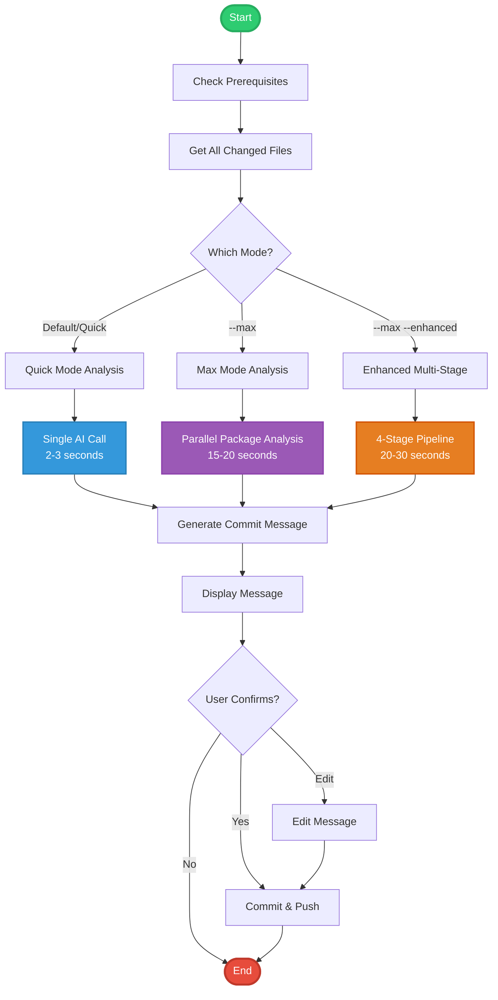

#### Quick Mode Analysis (Default)

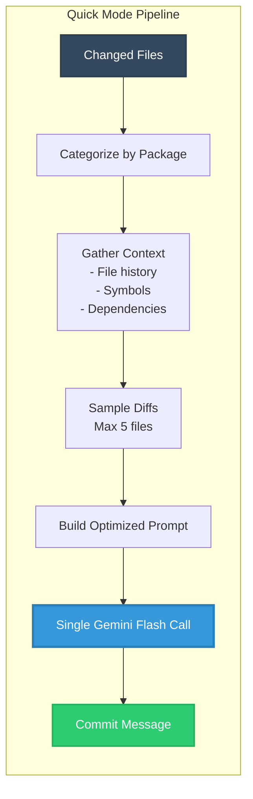

The quick mode works by:
1. **File Collection**: Uses `git status --porcelain` for all changes
2. **Smart Categorization**: Groups files by package using compiled regex patterns
3. **Context Gathering**: Extracts metadata without full diff analysis
4. **Prompt Optimization**: Builds a concise prompt with file summaries and sample diffs
5. **Single AI Call**: Uses Gemini Flash for 2-3 second response

#### Enhanced Multi-Stage Analysis

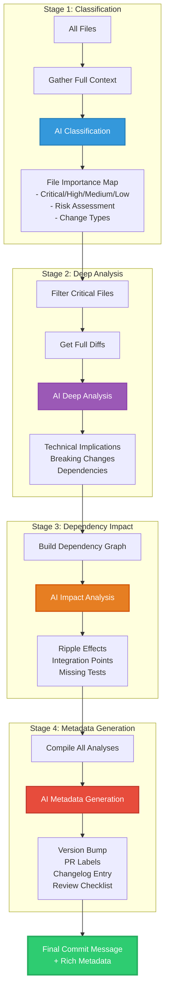

#### Context Gathering Deep Dive

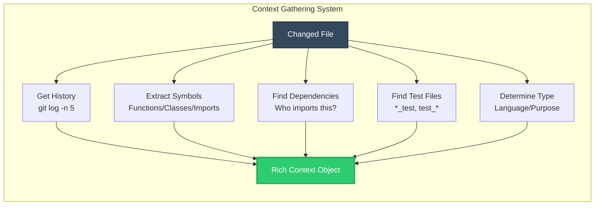

The context gathering system:
1. **File History**: Last 5 commits, modification dates, commit messages
2. **Symbol Extraction**: Language-aware parsing for functions, classes, imports
3. **Dependency Mapping**: Uses `git grep` to find importers
4. **Test Discovery**: Pattern matching for associated test files
5. **Type Classification**: Language, test, doc, config, generated

### How smart_commit.py Works - Technical Deep Dive

#### Overall Architecture

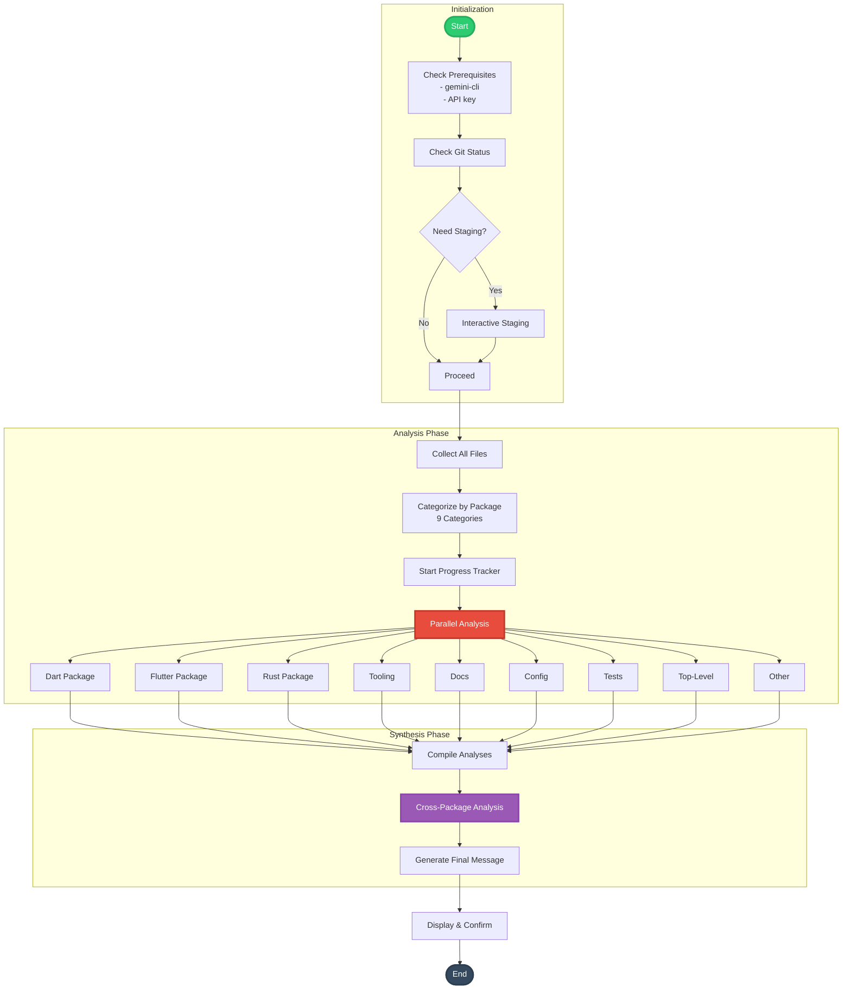

#### Package Analysis Pipeline

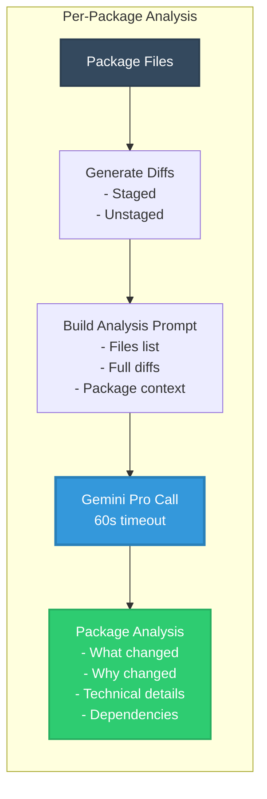

#### Progress Tracking System

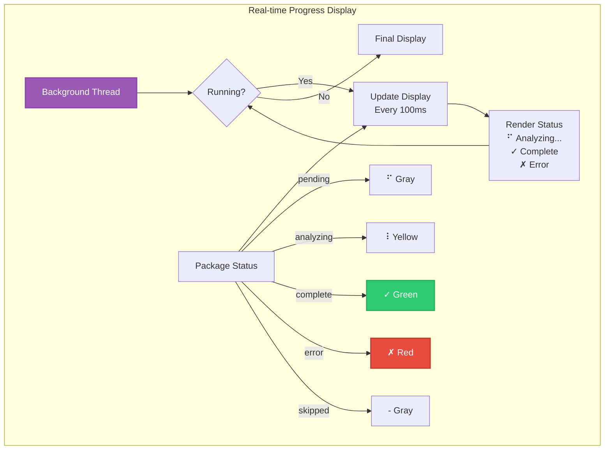

### Detailed Algorithm Explanations

#### 1. File Categorization Algorithm

```python
def categorize_files(files: List[str]) -> Dict[str, List[str]]:
    """
    Algorithm:
    1. For each file, strip git status prefixes (M, A, D, etc.)
    2. Apply regex patterns in order (most specific first)
    3. Fall back to location-based rules
    4. Group into 9 categories for comprehensive analysis
    """
    
    # Order matters - most specific patterns first
    for file in files:
        if file.startswith("dart/rust/"):
            category = "Rust"  # Rust FFI bindings
        elif file.startswith("flutter/"):
            category = "Flutter"  # Flutter-specific code
        elif file.startswith("dart/"):
            category = "Dart"  # Pure Dart code
        # ... continue pattern matching
```

#### 2. Context Extraction Algorithm

```python
def extract_symbols(file: str, diff: str) -> Dict[str, List[str]]:
    """
    Language-aware symbol extraction:
    1. Detect file language by extension
    2. Apply language-specific regex patterns
    3. Extract only from added/modified lines (+)
    4. Return categorized symbols
    """
    
    # Example for Python
    if file.endswith('.py'):
        # Function: def function_name(
        # Class: class ClassName:
        # Import: import module, from module import
```

#### 3. Parallel Analysis Coordination

```mermaid
graph TB
    subgraph "ThreadPoolExecutor Flow"
        Main[Main Thread] --> Submit[Submit 9 Tasks]
        Submit --> W1[Worker 1<br/>Dart]
        Submit --> W2[Worker 2<br/>Flutter]
        Submit --> W3[Worker 3<br/>Rust]
        Submit --> WN[Worker N<br/>...]
        
        W1 --> Future1[Future Result]
        W2 --> Future2[Future Result]
        W3 --> Future3[Future Result]
        WN --> FutureN[Future Result]
        
        Future1 --> Complete[as_completed()]
        Future2 --> Complete
        Future3 --> Complete
        FutureN --> Complete
        
        Complete --> Update[Update Progress]
        Update --> Collect[Collect Results]
    end
    
    style Main fill:#3498db,stroke:#2980b9,stroke-width:3px,color:#fff
    style Complete fill:#2ecc71,stroke:#27ae60,stroke-width:2px,color:#fff
```

#### 4. AI Prompt Engineering Strategy

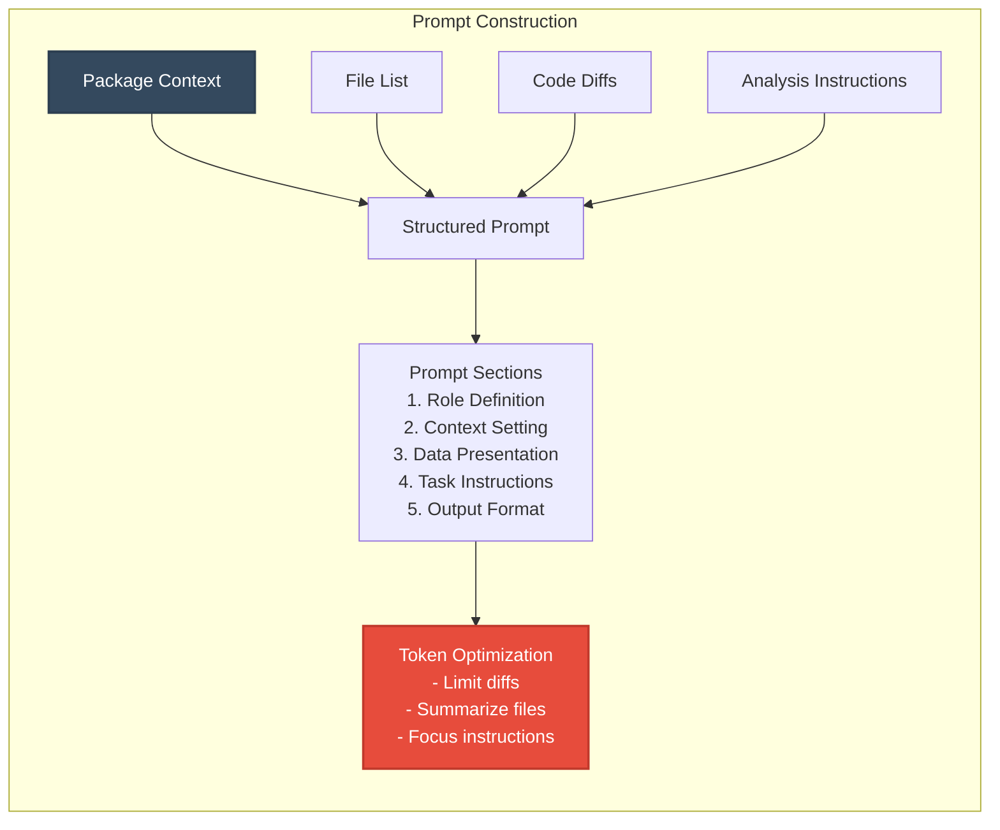

### Performance Characteristics

#### Time Complexity Analysis

```mermaid
graph TB
    subgraph "smart_commit_fast.py"
        Fast_Files[O(n) File Collection] --> Fast_Cat[O(n) Categorization]
        Fast_Cat --> Fast_Context[O(k) Context<br/>k = min(n, 20)]
        Fast_Context --> Fast_AI[O(1) Single AI Call]
        Fast_Total[Total: O(n) + 2-3s constant]
    end
    
    subgraph "smart_commit.py"
        Slow_Files[O(n) File Collection] --> Slow_Cat[O(n) Categorization]
        Slow_Cat --> Slow_Diff[O(n*m) Diff Generation<br/>m = lines per file]
        Slow_Diff --> Slow_AI[O(p) AI Calls<br/>p = packages with changes]
        Slow_AI --> Slow_Cross[O(1) Cross Analysis]
        Slow_Total[Total: O(n*m) + p*5s + 5s]
    end
    
    style Fast_Total fill:#2ecc71,stroke:#27ae60,stroke-width:3px,color:#fff
    style Slow_Total fill:#e74c3c,stroke:#c0392b,stroke-width:3px,color:#fff
```

### Memory Usage Patterns

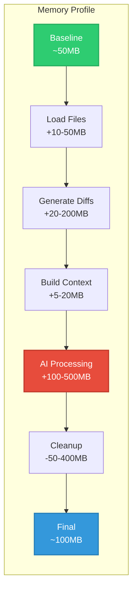

### Technical Implementation Details

#### Git Integration Layer

```mermaid
graph TB
    subgraph "Git Command Execution"
        Cmd[Git Command] --> Sub[subprocess.run()]
        Sub --> Timeout{Timeout?}
        Timeout -->|No| Output[Capture Output]
        Timeout -->|Yes| Kill[Kill Process]
        
        Output --> Sanitize[Text Sanitization]
        Kill --> Error[Error Handling]
        
        Sanitize --> Parse[Parse Results]
        Error --> Retry{Retry?}
        Retry -->|Yes| Cmd
        Retry -->|No| Fail[Report Failure]
    end
    
    style Cmd fill:#34495e,stroke:#2c3e50,stroke-width:2px,color:#fff
    style Sanitize fill:#3498db,stroke:#2980b9,stroke-width:2px,color:#fff
    style Error fill:#e74c3c,stroke:#c0392b,stroke-width:2px,color:#fff
```

The Git integration layer handles:
- **Command Execution**: Safe subprocess calls with timeouts
- **Output Sanitization**: Removes ANSI codes and control characters
- **Error Recovery**: Graceful handling of git failures
- **Performance**: Caches frequently used commands

#### Symbol Extraction Engine

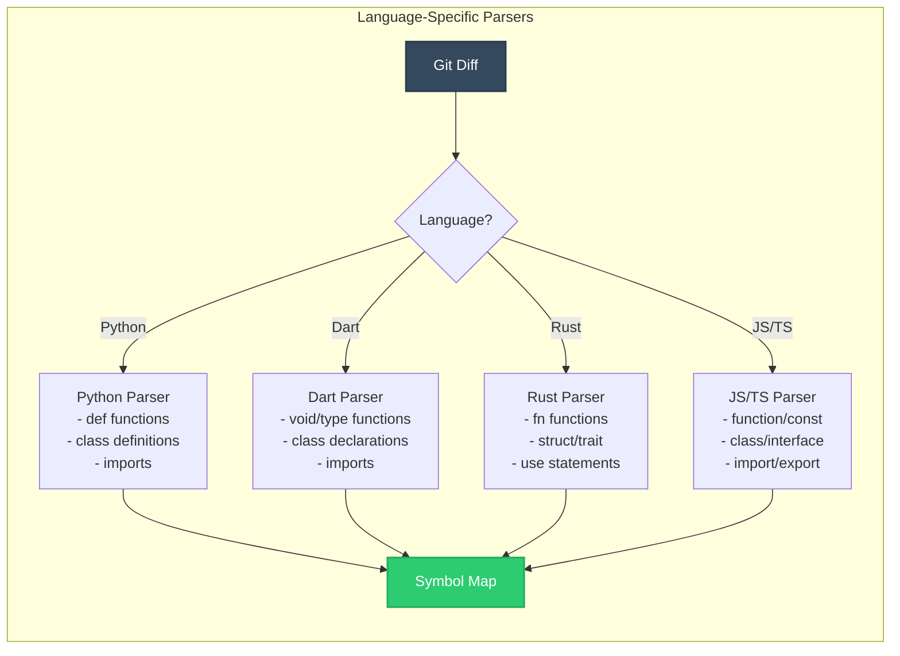

#### AI Communication Protocol

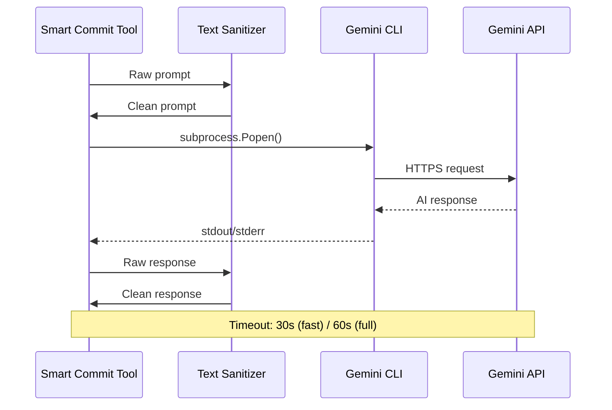

### Advanced Features Implementation

#### 1. Dependency Graph Construction

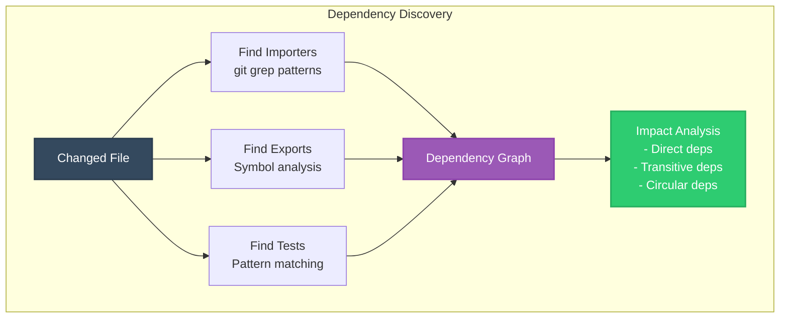

#### 2. Intelligent Diff Limiting

```python
def get_limited_diff(file: str, max_lines: int) -> str:
    """
    Smart diff limiting algorithm:
    1. Get full diff size
    2. If under limit, return full diff
    3. If over limit:
       - Prioritize file header (@@)
       - Include first N and last M lines
       - Add context around symbols
       - Indicate truncation points
    """
```

#### 3. Prompt Token Optimization

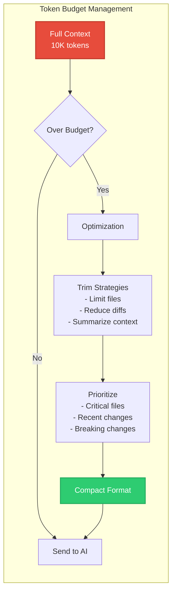

### Error Handling and Recovery

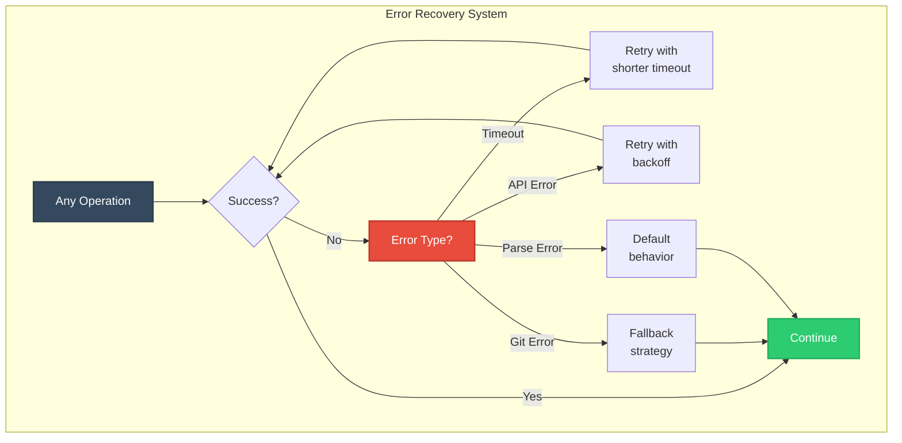

### Caching Architecture

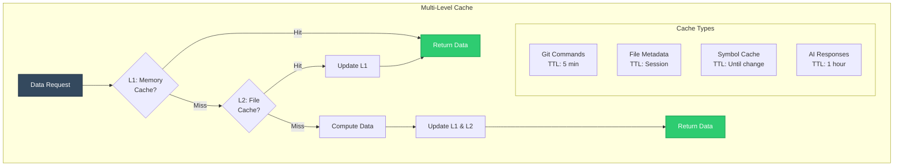

### Metadata Generation Pipeline

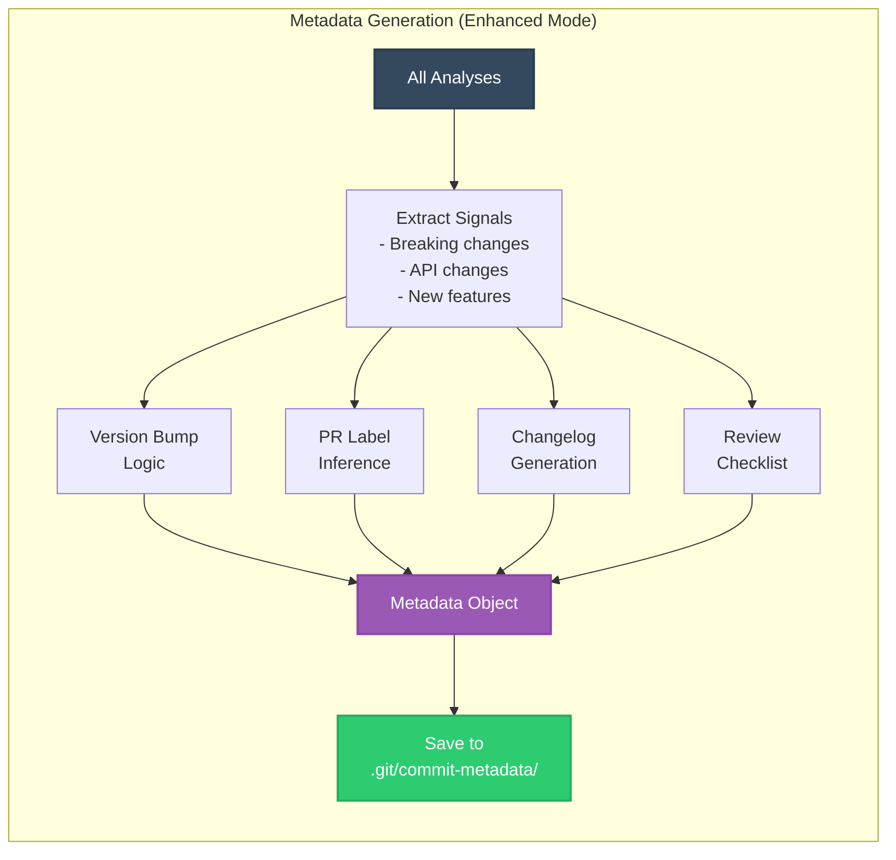

### Optimization Strategies

#### 1. Parallel Processing Architecture

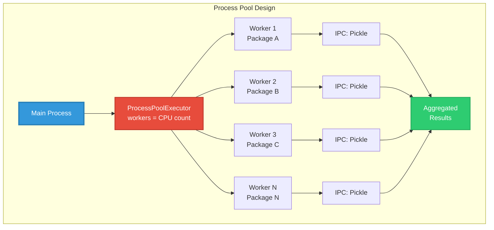

#### 2. Memory-Efficient Diff Processing

```python
def process_large_diff(file_path: str, chunk_size: int = 1000):
    """
    Stream-based diff processing for large files:
    1. Read diff in chunks
    2. Process each chunk independently
    3. Aggregate results without loading full diff
    4. Yield processed chunks for immediate use
    """
    with subprocess.Popen(['git', 'diff', file_path], 
                         stdout=subprocess.PIPE, 
                         text=True) as proc:
        buffer = []
        for line in proc.stdout:
            buffer.append(line)
            if len(buffer) >= chunk_size:
                yield process_chunk(buffer)
                buffer = []
        if buffer:
            yield process_chunk(buffer)
```

### Integration Points

```mermaid
graph TB
    subgraph "External Integrations"
        Tool[Smart Commit] --> Git[Git CLI<br/>- status<br/>- diff<br/>- log<br/>- grep]
        Tool --> Gemini[Gemini CLI<br/>- prompt<br/>- model selection]
        Tool --> FS[File System<br/>- read files<br/>- find patterns<br/>- cache data]
        Tool --> Env[Environment<br/>- API keys<br/>- config vars<br/>- user prefs]
        
        Git --> Output[Unified<br/>Output]
        Gemini --> Output
        FS --> Output
        Env --> Output
    end
    
    style Tool fill:#34495e,stroke:#2c3e50,stroke-width:3px,color:#fff
    style Output fill:#2ecc71,stroke:#27ae60,stroke-width:2px,color:#fff
```

### Security Considerations

```mermaid
graph LR
    subgraph "Security Layers"
        Input[User Input] --> Sanitize[Input Sanitization<br/>- Remove control chars<br/>- Escape sequences<br/>- Path validation]
        
        Sanitize --> Validate[Validation<br/>- File paths<br/>- Git commands<br/>- API inputs]
        
        Validate --> Execute[Safe Execution<br/>- Subprocess limits<br/>- Timeout controls<br/>- Resource limits]
        
        Execute --> Output[Output Filtering<br/>- No secrets<br/>- No PII<br/>- Clean responses]
    end
    
    style Input fill:#e74c3c,stroke:#c0392b,stroke-width:2px,color:#fff
    style Output fill:#2ecc71,stroke:#27ae60,stroke-width:2px,color:#fff
```

## smart_commit_fast.py - The Speed Champion

### Key Innovations

#### 1. Single-Pass Analysis (Default Mode)
```python
def analyze_quick_mode(self, all_files: List[str]) -> str:
    """Single fast AI call for quick mode with enhanced context"""
    # Gather context in parallel
    # Build optimized prompt
    # Single AI call with Flash model
    # Return in 2-3 seconds
```

#### 2. Enhanced Multi-Stage Analysis (--enhanced flag)
Revolutionary 4-stage pipeline for deep understanding:

**Stage 1: Classification**
- Categorizes files by importance (critical/high/medium/low)
- Identifies change types (feature/fix/refactor/perf)
- Assesses risk levels
- Determines which files need deep analysis

**Stage 2: Deep Analysis**
- Focuses on critical files only
- Analyzes technical implications
- Identifies breaking changes
- Maps dependencies

**Stage 3: Dependency Impact**
- Analyzes ripple effects
- Identifies affected packages
- Finds integration points
- Suggests missing tests

**Stage 4: Metadata Generation**
- Suggests semantic version bumps
- Generates changelog entries
- Recommends PR labels
- Creates review checklists

#### 3. Smart Context Gathering
```python
class EnhancedContextGatherer:
    def gather_enhanced_context(self, files, diffs):
        # Extract code symbols
        # Analyze file history
        # Find related issues
        # Map dependencies
        # Identify test coverage
```

### Usage Examples

#### Default Mode (Fastest - 2-3s)
```bash
./tooling/smart_commit_fast.py
```

#### Max Analysis Mode (15-20s)
```bash
./tooling/smart_commit_fast.py --max
```

#### Enhanced Multi-Stage Mode (20-30s)
```bash
./tooling/smart_commit_fast.py --max --enhanced
```

#### Skip Cross-Package Analysis
```bash
./tooling/smart_commit_fast.py --max --skip-cross
```

### Performance Optimizations

1. **Parallel Diff Collection**: Uses ProcessPoolExecutor for true parallelism
2. **Limited Diff Sizes**: Caps at 500 lines per package
3. **Smart File Selection**: Prioritizes important files
4. **Batch Processing**: Groups related operations
5. **Compiled Regex Patterns**: Pre-compiled for speed

## smart_commit.py - The Thoroughbred

### Architecture

#### 1. Comprehensive Package Analysis
Analyzes each package individually:
- Dart package changes
- Flutter package changes
- Rust FFI bindings
- Tooling updates
- Documentation changes
- Configuration files
- Test modifications
- Top-level files

#### 2. Cross-Package Dependency Analysis
After individual analysis, performs cross-package impact assessment:
```python
def analyze_cross_package_impacts(self, all_analyses: str) -> str:
    """Analyze cross-package dependencies and impacts"""
    # Identify cross-package dependencies
    # Find interface changes
    # Map integration points
    # Detect potential conflicts
    # Assess architecture impact
```

#### 3. Real-Time Progress Tracking
Visual feedback with spinner animation:
```python
class ProgressTracker:
    """Handle progress display with spinner animation"""
    # Shows real-time status for each package
    # ⠋ Analyzing Dart...
    # ✓ Flutter complete
    # ⠸ Analyzing Rust...
```

### Advanced Features

1. **Interactive Staging**: Choose which files to include
2. **GitHub Integration**: Shows commit URL after push
3. **Editor Integration**: Edit generated messages in your preferred editor
4. **Regeneration Option**: Not happy? Regenerate with one command

## Usage Guide

### Prerequisites

1. **Install gemini-cli**:
   ```bash
   # Install via pip or your package manager
   pip install gemini-cli
   ```

2. **Set API Key**:
   ```bash
   export GEMINI_API_KEY="your-api-key"
   ```

3. **Python 3.6+** installed

### Workflow Examples

#### Daily Development Workflow
```bash
# Make your changes
vim src/feature.py

# Quick commit with smart analysis
./tooling/smart_commit_fast.py

# Review generated message (2-3s)
# Press Y to commit
```

#### Complex Feature Workflow
```bash
# Multiple package changes
vim dart/lib/api.dart
vim flutter/lib/widget.dart
vim rust/src/ffi.rs

# Use enhanced analysis
./tooling/smart_commit_fast.py --max --enhanced

# Review comprehensive analysis
# See suggested version bump
# Check breaking changes
# Commit with confidence
```

#### PR-Ready Commits
```bash
# Use the original tool for maximum detail
./tooling/smart_commit.py

# Get individual package analyses
# Cross-package dependency mapping
# Comprehensive commit message
# Perfect for PR descriptions
```

### Commit Message Quality

Both tools generate messages following this structure:

```
<type>(<scope>): <subject>

<body explaining changes>

<footer with breaking changes>
```

Example output:
```
feat(dart): implement advanced vector search with HNSW algorithm

- Added HNSWIndex class for hierarchical navigable small world graphs
- Implemented efficient k-NN search with O(log n) complexity
- Added comprehensive test suite with 95% coverage
- Integrated with existing VectorStore interface

Flutter package:
- Updated VectorSearchWidget to use new HNSW backend
- Added performance monitoring UI components
- Improved search result rendering performance by 40%

Rust FFI:
- Implemented native HNSW bindings for performance
- Added memory-safe wrappers for index operations
- Optimized vector distance calculations with SIMD

BREAKING CHANGE: VectorStore.search() now requires IndexType parameter
Migration: Add IndexType.HNSW to existing search calls
```

## Performance Optimization

### Speed Techniques

1. **Model Selection**:
   - Flash models for speed (gemini-2.0-flash-exp)
   - Pro models for depth (gemini-2.5-pro)
   - Automatic selection based on context size

2. **Prompt Optimization**:
   - Structured prompts for faster inference
   - Limited context windows
   - Focused analysis directives

3. **Parallel Processing**:
   ```python
   with ProcessPoolExecutor(max_workers=len(packages)) as executor:
       # True parallel analysis
   ```

4. **Caching Strategy**:
   - File metadata caching
   - Symbol extraction caching
   - Git command output caching

### Memory Management

1. **Diff Limiting**:
   ```python
   MAX_DIFF_LINES = 500  # Per package
   MAX_DIFF_PER_FILE = 100  # Per file
   ```

2. **File Prioritization**:
   - Analyze only top 20 files in quick mode
   - Focus on critical files in enhanced mode

## Advanced Features

### 1. Metadata Generation (smart_commit_fast.py --enhanced)

The tool generates rich metadata beyond the commit message:

```json
{
  "semantic_version_bump": "minor",
  "changelog_entry": {
    "type": "Added",
    "description": "Advanced vector search with HNSW algorithm",
    "breaking_changes": ["VectorStore.search() signature changed"]
  },
  "pr_labels": ["enhancement", "breaking-change", "performance"],
  "review_checklist": [
    "Verify HNSW index performance benchmarks",
    "Check memory usage with large datasets",
    "Validate migration guide completeness"
  ],
  "documentation_updates": ["API.md", "MIGRATION.md"],
  "follow_up_tasks": ["Add batch search optimization", "Implement index persistence"]
}
```

### 2. Issue Tracking Integration

Automatically detects and references issues:
- From branch names: `feature/issue-123-vector-search`
- From recent commits: `Fixes #456`
- From PR references: `Related to PR #789`

### 3. Symbol-Aware Analysis

Extracts and analyzes code symbols:
```python
{
  "functions": ["createIndex", "searchVectors", "calculateDistance"],
  "classes": ["HNSWIndex", "VectorNode", "SearchResult"],
  "imports": ["numpy", "scikit-learn", "faiss"],
  "exports": ["VectorSearchAPI", "IndexConfiguration"]
}
```

### 4. Dependency Mapping

Maps file relationships:
- Which files import the changed file
- Test files for the changed code
- Related configuration files
- Documentation that might need updates

## Best Practices

### 1. Choose the Right Tool

**Use smart_commit_fast.py when:**
- Making focused changes to 1-2 packages
- Daily development commits
- Need quick turnaround
- Changes are well-understood

**Use smart_commit.py when:**
- Complex multi-package changes
- Major refactoring
- Breaking changes
- Need detailed documentation

### 2. Optimize Your Workflow

1. **Pre-stage files**: Stage before running to skip interactive prompt
   ```bash
   git add .
   ./tooling/smart_commit_fast.py
   ```

2. **Use aliases**: Add to your shell config
   ```bash
   alias scf='./tooling/smart_commit_fast.py'
   alias sce='./tooling/smart_commit_fast.py --max --enhanced'
   alias sc='./tooling/smart_commit.py'
   ```

3. **Review metadata**: Use enhanced mode for PRs to get labels and checklists

### 3. Commit Message Guidelines

1. **Let AI do the heavy lifting**: Don't pre-edit, let the tool analyze
2. **Review for accuracy**: AI is good but verify technical details
3. **Add human context**: Edit to add "why" if AI misses it
4. **Keep conventional**: Stick to the generated format

## Troubleshooting

### Common Issues

1. **"Gemini API timeout"**
   - Solution: Reduce diff size or use quick mode
   - Check API key validity
   - Verify network connectivity

2. **"No changes detected"**
   - Solution: Check `git status`
   - Ensure files are saved
   - Verify you're in the right directory

3. **"Analysis failed for package X"**
   - Solution: Check if package has actual changes
   - Verify file permissions
   - Look for syntax errors in changed files

### Debug Mode

Enable verbose output:
```bash
DEBUG=1 ./tooling/smart_commit_fast.py
```

### Performance Tuning

Adjust timeouts and limits:
```python
# In smart_commit_fast.py
Config.MAX_DIFF_LINES = 300  # Reduce for faster analysis
Config.MAX_FILES_PER_PACKAGE = 3  # Fewer files to analyze
```

## Future Roadmap

### Planned Enhancements

1. **Local LLM Support**: Use Ollama or llama.cpp for offline commits
2. **Incremental Analysis**: Cache unchanged file analysis
3. **Git Hook Integration**: Automatic analysis on `git commit`
4. **IDE Plugins**: VSCode and IntelliJ integration
5. **Team Templates**: Customizable commit message templates
6. **Metrics Dashboard**: Track commit quality over time
7. **PR Description Generation**: Auto-generate PR descriptions
8. **Change Impact Prediction**: Estimate bug risk and test coverage

### Experimental Features

1. **Streaming Analysis**: Real-time analysis as you type
2. **Voice Commits**: Describe changes verbally
3. **Visual Diff Analysis**: Understand UI changes
4. **Test Generation**: Suggest tests for changes
5. **Documentation Updates**: Auto-update docs based on changes

## Comprehensive Tool Comparison

### Decision Flow Chart

```mermaid
graph TB
    Start([Need to Commit]) --> Size{Change Size?}
    
    Size -->|"< 10 files"| Quick[Use smart_commit_fast.py<br/>Default mode]
    Size -->|"10-50 files"| Medium{Complex Changes?}
    Size -->|"> 50 files"| Large{Time Available?}
    
    Medium -->|No| Quick
    Medium -->|Yes| Enhanced[Use smart_commit_fast.py<br/>--max --enhanced]
    
    Large -->|"< 1 min"| Quick
    Large -->|"1-5 min"| Enhanced
    Large -->|"> 5 min"| Full[Use smart_commit.py<br/>Full analysis]
    
    Quick --> Result1[2-3 seconds<br/>Good message]
    Enhanced --> Result2[20-30 seconds<br/>Great message<br/>+ metadata]
    Full --> Result3[30-50 seconds<br/>Comprehensive<br/>+ cross-package]
    
    style Start fill:#34495e,stroke:#2c3e50,stroke-width:3px,color:#fff
    style Quick fill:#2ecc71,stroke:#27ae60,stroke-width:2px,color:#fff
    style Enhanced fill:#e67e22,stroke:#d35400,stroke-width:2px,color:#fff
    style Full fill:#e74c3c,stroke:#c0392b,stroke-width:2px,color:#fff
```

### Feature Matrix Visualization

```mermaid
graph LR
    subgraph "smart_commit_fast.py Features"
        F1[Ultra-fast 2-3s]
        F2[Single AI call]
        F3[Smart context]
        F4[Enhanced mode]
        F5[Metadata generation]
        F6[Process parallelism]
        F7[Symbol extraction]
        F8[Dependency mapping]
    end
    
    subgraph "smart_commit.py Features"
        S1[Comprehensive 30-50s]
        S2[Multi-package analysis]
        S3[Cross-package deps]
        S4[Real-time progress]
        S5[Interactive staging]
        S6[Thread parallelism]
        S7[Deep technical analysis]
        S8[Architecture impact]
    end
    
    style F1 fill:#2ecc71,stroke:#27ae60,stroke-width:2px,color:#fff
    style F4 fill:#e67e22,stroke:#d35400,stroke-width:2px,color:#fff
    style S1 fill:#e74c3c,stroke:#c0392b,stroke-width:2px,color:#fff
    style S2 fill:#9b59b6,stroke:#8e44ad,stroke-width:2px,color:#fff
```

### Performance vs Quality Trade-off

```mermaid
graph TB
    subgraph "Trade-off Analysis"
        Fast[smart_commit_fast.py<br/>Default] --> Q1[Quality: 85%<br/>Speed: 2-3s]
        FastMax[smart_commit_fast.py<br/>--max] --> Q2[Quality: 90%<br/>Speed: 15-20s]
        FastEnhanced[smart_commit_fast.py<br/>--max --enhanced] --> Q3[Quality: 95%<br/>Speed: 20-30s]
        Full[smart_commit.py] --> Q4[Quality: 98%<br/>Speed: 30-50s]
        
        Q1 --> Use1[Daily commits<br/>Small changes<br/>Clear purpose]
        Q2 --> Use2[Feature commits<br/>Multiple files<br/>Single package]
        Q3 --> Use3[Complex features<br/>Need metadata<br/>PR preparation]
        Q4 --> Use4[Major changes<br/>Multi-package<br/>Architecture changes]
    end
    
    style Fast fill:#2ecc71,stroke:#27ae60,stroke-width:2px,color:#fff
    style FastMax fill:#3498db,stroke:#2980b9,stroke-width:2px,color:#fff
    style FastEnhanced fill:#e67e22,stroke:#d35400,stroke-width:2px,color:#fff
    style Full fill:#e74c3c,stroke:#c0392b,stroke-width:2px,color:#fff
```

### Architecture Comparison

```mermaid
graph TB
    subgraph "smart_commit_fast.py Architecture"
        Fast_Entry[Entry Point] --> Fast_Mode{Mode Selection}
        Fast_Mode --> Fast_Quick[Quick Pipeline<br/>1 AI call]
        Fast_Mode --> Fast_Max[Max Pipeline<br/>Parallel analysis]
        Fast_Mode --> Fast_Enhanced[Enhanced Pipeline<br/>4-stage analysis]
        
        Fast_Quick --> Fast_Out[Output]
        Fast_Max --> Fast_Out
        Fast_Enhanced --> Fast_Meta[Output + Metadata]
    end
    
    subgraph "smart_commit.py Architecture"
        Slow_Entry[Entry Point] --> Slow_Stage[Interactive Staging]
        Slow_Stage --> Slow_Cat[Categorization]
        Slow_Cat --> Slow_Parallel[Parallel Package Analysis]
        Slow_Parallel --> Slow_Cross[Cross-Package Analysis]
        Slow_Cross --> Slow_Gen[Message Generation]
        Slow_Gen --> Slow_Out[Comprehensive Output]
    end
    
    style Fast_Entry fill:#2ecc71,stroke:#27ae60,stroke-width:2px,color:#fff
    style Fast_Enhanced fill:#e67e22,stroke:#d35400,stroke-width:2px,color:#fff
    style Slow_Entry fill:#e74c3c,stroke:#c0392b,stroke-width:2px,color:#fff
    style Slow_Cross fill:#9b59b6,stroke:#8e44ad,stroke-width:2px,color:#fff
```

## Conclusion

The Smart Commit tools transform the mundane task of writing commit messages into an intelligent, automated process that improves code documentation, team communication, and development velocity. Whether you need a quick 2-second commit or a comprehensive analysis of complex changes, these tools adapt to your workflow while maintaining high-quality standards.

Choose `smart_commit_fast.py` for speed, `smart_commit.py` for depth, or use both as your workflow demands. The future of git commits is here, and it's intelligent. 