# `sync_changelogs.py` — Deep Technical Documentation

> **Version:** 7.3.0  **Author:** Tsavo Knott, 2025  **License:** Proprietary – All Rights Reserved

---

## 🔑 Key Concept: Version Workflow

Understanding how `sync_changelogs.py` handles versions is crucial:

1. **Current Tag Mode** (default): Updates the **current released version** (e.g., v0.0.8)
   - Works on the latest tag that already exists
   - Adds any commits made AFTER the tag was created
   - This is for catching post-release commits

2. **Next Version Creation**: Handled by `prepare_new_patch.py`
   - Creates NEW version sections (e.g., v0.0.9) in all changelogs
   - After this runs, `sync_changelogs.py` will work on the new version

### Example Workflow

```bash
# Current state: v0.0.8 is the latest tag

# 1. Update v0.0.8 with any post-tag commits
python tooling/sync_changelogs.py

# 2. Prepare for next release (creates v0.0.9 sections)
python tooling/prepare_new_patch.py

# 3. Now sync_changelogs will work on v0.0.9
python tooling/sync_changelogs.py

# 4. When ready, create the release
python tooling/push_new_patch.py
```

---

## Table of Contents

1. [Introduction](#introduction)
2. [Goals & Problem Statement](#goals--problem-statement)
3. [Key Features](#key-features)
4. [High‑Level Workflow](#high-level-workflow)
5. [System Architecture](#system-architecture)

   1. [Class & Responsibility Map](#class--responsibility-map)
   2. [Data Flow Diagram](#data-flow-diagram)
6. [Internal Modules Explained](#internal-modules-explained)

   1. [`Config`](#config)
   2. [`CacheManager`](#cachemanager)
   3. [`GitOps`](#gitops)
   4. [`ChangelogManager`](#changelogmanager)
   5. [`LLMClient`](#llmclient)
   6. [`CommitContextAnalyzer`](#commitcontextanalyzer)

   7. [`FileAnalyzer` & `EnhancedFileAnalyzer`](#fileanalyzer--enhancedfileanalyzer)
   8. [`ChangelogGenerator` & `EnhancedChangelogGenerator`](#changeloggenerator--enhancedchangeloggenerator)
   9. [`ChangelogSync`](#changelogsync)
7. [CLI Usage](#cli-usage)
8. [Configuration File (`.changelog.yml`)](#configuration-file-changelogyml)
9. [Environment Variables](#environment-variables)
10. [Performance & Scalability](#performance--scalability)
11. [Error Handling & Recovery](#error-handling--recovery)
12. [Extending & Customising](#extending--customising)
13. [Troubleshooting & FAQ](#troubleshooting--faq)
14. [Roadmap & Future Work](#roadmap--future-work)
15. [License](#license)

---

## Introduction

`sync_changelogs.py` is a production‑grade, AI‑powered changelog generator and synchroniser designed for **monorepos** containing multiple language‑specific packages (Dart, Flutter, Rust, and a project‑wide root). It leverages **LLM‑assisted analysis** to translate commits, diffs, and file histories into human‑readable, [Keep a Changelog](https://keepachangelog.com)‑compliant release notes.

## Goals & Problem Statement

| Goal                               | Why it Matters                                                                        |
| ---------------------------------- | ------------------------------------------------------------------------------------- |
| **Automated, accurate changelogs** | Manual changelogs are error‑prone and often outdated.                                 |
| **Package‑aware generation**       | Monorepos need scoped release notes per package, not a single flat file.              |
| **Context‑rich entries**           | Commit messages alone rarely capture user‑impact; diff & file context bridge the gap. |
| **Scalable performance**           | Must handle thousands of commits without blowing API quotas or user patience.         |
| **Idempotent sync**                | Running the tool repeatedly should never duplicate entries.                           |

## Key Features

* **Tag‑based processing** (oldest→newest) with backfill.
* **Multi‑package support** via regex‑based path mapping.
* **LLM‑driven** commit, diff, and file inventory analysis.
* **Conventional Commit** parsing fallback (no LLM needed).
* **Smart historical mode** that fills gaps between tags.
* **Uncommitted changes detection** & interactive prompts for safety.
* **Dry‑run** and **progress bars** for CI visibility.
* **Caching** of LLM responses → dramatic cost & latency reductions.
* **Parallel processing** with adaptive worker count (CPU‑aware & API‑throttle‑safe).
* **Parallelized final cleanup** (v7.2) - 3-4x faster link fixing and formatting.
* **Smart commit range detection** (v7.3) - finds last changelog sync automatically.
* **Fast regex-based link fixing** (v7.3) - 80% faster cleanup without LLM.
* **Smart commit message generation** (v7.3) - AI-powered commit messages.
* **Interactive commit workflow** (v7.3) - optional auto-commit with review.
* **No screen clearing** (v7.3) - Git pager disabled for better UX.
* **Comprehensive CLI** with 30+ quality‑of‑life flags.

## High‑Level Workflow

```mermaid
flowchart TB
    A[CLI Invocation] --> B[Detect Git Context]
    B --> C{Mode}
    C -->|Current Branch| D[Collect Commits]
    C -->|Smart Historical| D
    C -->|Rebuild All| E[Iterate Tags]
    D --> F[Group Commits → Packages]
    F --> G[Parallel Package Workers]
    G --> H[Analyze Commits & Files (LLM)]
    H --> I[Generate/Update CHANGELOG.md]
    I --> J[Post‑processing & Link Fixup]
    J --> K[Metrics & Summary]
```

## System Architecture

### Class & Responsibility Map

| Class                            | Core Responsibility                                         |
| -------------------------------- | ----------------------------------------------------------- |
| **`Config`**                     | Load & expose YAML configuration overrides.                 |
| **`CacheManager`**               | TTL‑based pickle cache for expensive LLM calls.             |
| **`GitOps`**                     | Safe, ANSI‑stripped shell wrapper for all Git interactions. |
| **`ChangelogManager`**           | Parse, validate, merge, and write changelog files.          |
| **`LLMClient`**                  | Centralised retry logic, model fallback chain, caching.     |
| **`CommitContextAnalyzer`**      | Batch commit analysis → rich context.                       |
| **`FileAnalyzer`**               | Inventories & prioritises changed files.                    |
| **`EnhancedFileAnalyzer`**       | Adds diff collection + analysis layers.                     |
| **`ChangelogGenerator`**         | Prompt‑crafting & conventional‑commit fallback.             |
| **`EnhancedChangelogGenerator`** | Orchestrates full‑stack analysis pipeline.                  |
| **`ChangelogSync`**              | CLI front‑end; modes, workers, final cleanup.               |

*(See [Internal Modules](#internal-modules-explained) for deep dives.)*

### Data Flow Diagram

1. **Git Collection** → *Raw commits + file lists*
2. **Context Enrichment** → Commit messages → Conventional parse → Attribution
3. **LLM Analysis**
   a. Commit narratives
   b. File inventory & diff insights
4. **Prompt Synthesis** → Combines context, history, and existing entries.
5. **LLM Generation** → Draft Markdown sections.
6. **Validation & Merge** → Ensures uniqueness, canonical section order.
7. **Post‑Fix Pass** → Repairs malformed links, trims placeholders.

## Technical Deep Dive

### Overall System Flow

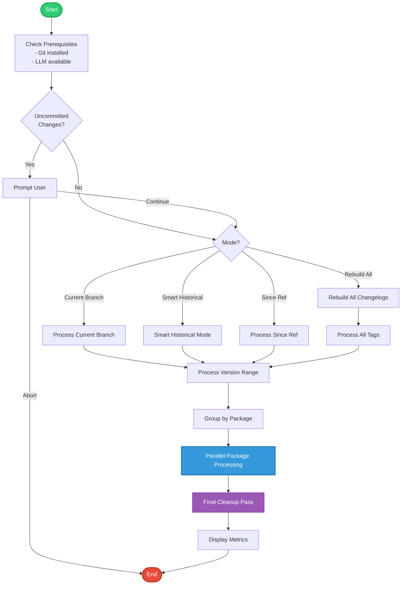

### Mode Selection Logic

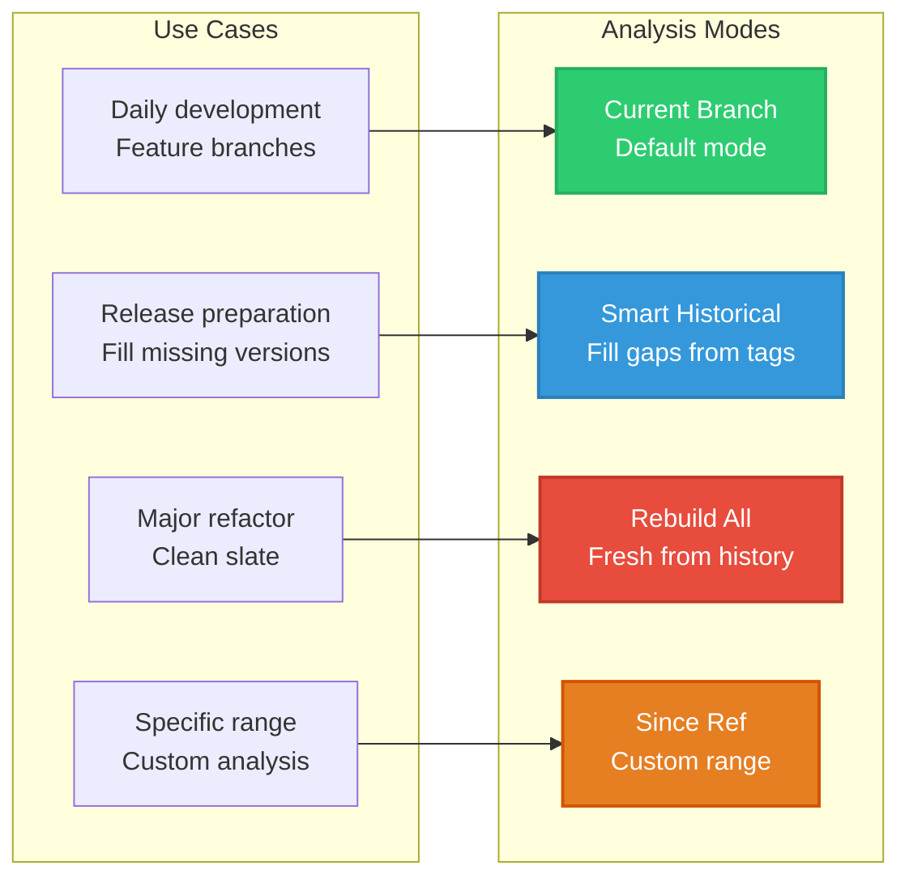

### Package Processing Pipeline

```mermaid
graph TB
    subgraph "Per-Package Processing"
        Commits[Package Commits] --> CheckExisting{Has Content<br/>for Version?}
        CheckExisting -->|Yes| CheckNew{New Commits?}
        CheckExisting -->|No| Analyze
        CheckNew -->|No| Skip[Skip Package]
        CheckNew -->|Yes| Analyze
        
        Analyze[Analyze Files] --> Enhanced{Enhanced<br/>Mode?}
        Enhanced -->|Yes| EnhancedPath[Enhanced Analysis]
        Enhanced -->|No| StandardPath[Standard Analysis]
        
        EnhancedPath --> CommitContext[Analyze Commit Context]
        CommitContext --> FileInventory[Build File Inventory]
        FileInventory --> DiffAnalysis[Analyze Diffs]
        DiffAnalysis --> GenerateEnhanced[Generate with Context]
        
        StandardPath --> SelectFiles[Select Relevant Files]
        SelectFiles --> GenerateStandard[Generate Changelog]
        
        GenerateEnhanced --> Merge[Merge with Existing]
        GenerateStandard --> Merge
        Merge --> Save[Save Changelog]
        Skip --> NAEntry[Create N/A Entry]
    end
    
    style Commits fill:#34495e,stroke:#2c3e50,stroke-width:2px,color:#fff
    style EnhancedPath fill:#9b59b6,stroke:#8e44ad,stroke-width:2px,color:#fff
    style StandardPath fill:#3498db,stroke:#2980b9,stroke-width:2px,color:#fff
    style Save fill:#2ecc71,stroke:#27ae60,stroke-width:2px,color:#fff
```

### LLM Analysis Architecture

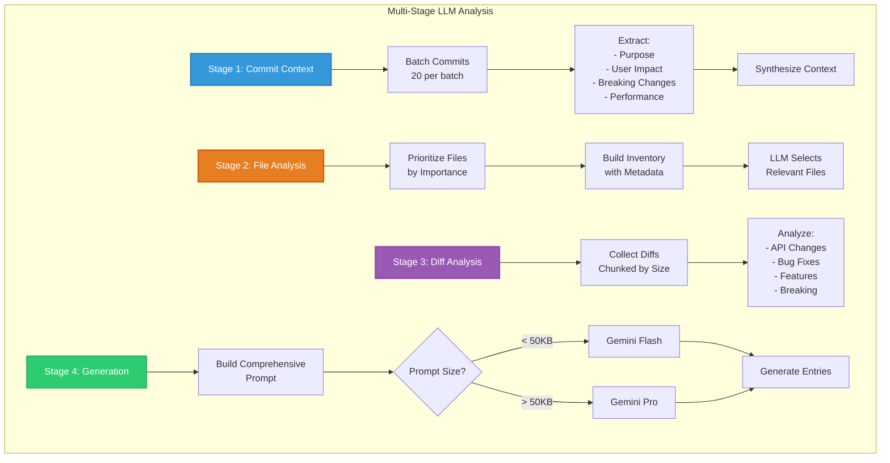

### Parallel Processing Architecture

```mermaid
graph TB
    subgraph "Worker Pool Management"
        Main[Main Thread] --> Calculate[Calculate Workers]
        Calculate --> Auto{Auto Mode?}
        Auto -->|Yes| OptimalCalc[Calculate Optimal<br/>Based on:<br/>- CPU cores<br/>- Commit count<br/>- Package count<br/>- LLM limits]
        Auto -->|No| Manual[Use Manual Setting]
        
        OptimalCalc --> Pool[ThreadPoolExecutor]
        Manual --> Pool
        
        Pool --> Submit[Submit Package Tasks]
        Submit --> W1[Worker 1<br/>Root Package]
        Submit --> W2[Worker 2<br/>Dart Package]
        Submit --> W3[Worker 3<br/>Flutter Package]
        Submit --> W4[Worker 4<br/>Rust Package]
        
        W1 --> Future1[Future Result]
        W2 --> Future2[Future Result]
        W3 --> Future3[Future Result]
        W4 --> Future4[Future Result]
        
        Future1 --> Collect[as_completed()]
        Future2 --> Collect
        Future3 --> Collect
        Future4 --> Collect
        
        Collect --> Results[Aggregate Results]
    end
    
    style Main fill:#34495e,stroke:#2c3e50,stroke-width:3px,color:#fff
    style OptimalCalc fill:#3498db,stroke:#2980b9,stroke-width:2px,color:#fff
    style Pool fill:#e74c3c,stroke:#c0392b,stroke-width:3px,color:#fff
    style Results fill:#2ecc71,stroke:#27ae60,stroke-width:2px,color:#fff
```

### Cache Management System

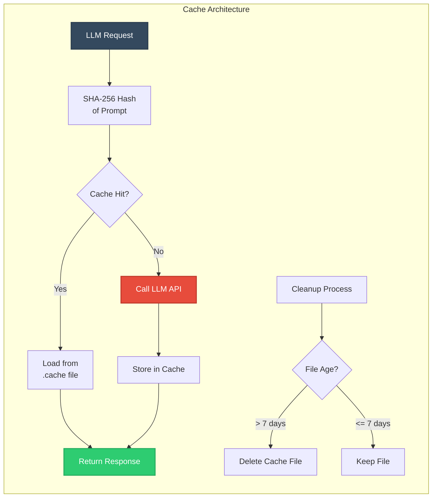

### Changelog Merge Algorithm

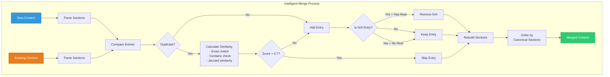

### Final Cleanup Pipeline (v7.2 - Parallelized)

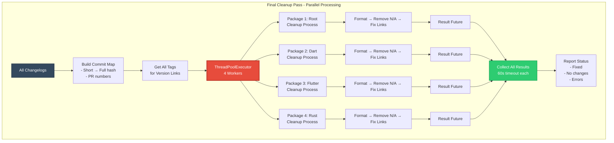

#### Per-Package Cleanup Process (Thread-Safe)

```mermaid
graph TB
    subgraph "Single Package Cleanup"
        Package[Package Changelog] --> Read[Read Content<br/>Thread-safe]
        
        Read --> Format[Apply Formatting<br/>- Version headers<br/>- Spacing<br/>- Consistency]
        
        Format --> RemoveNA[Remove N/A Entries<br/>from Sections]
        RemoveNA --> ChunkVersion[Process Each Version]
        
        ChunkVersion --> Size{Version Size?}
        Size -->|< 6KB| FixWhole[Fix Entire Version]
        Size -->|>= 6KB| FixSections[Fix by Section]
        
        FixWhole --> LLMFix[LLM Link Fixing]
        FixSections --> FixIncremental[Fix Line by Line]
        
        LLMFix --> Reconstruct[Reconstruct Changelog]
        FixIncremental --> Reconstruct
        
        Reconstruct --> Compare{Changed?}
        Compare -->|Yes| Save[Save Fixed Version]
        Compare -->|No| NoOp[Return No Changes]
        
        Save --> Status[Return Status:<br/>fixed]
        NoOp --> Status2[Return Status:<br/>no_changes]
    end
    
    style Package fill:#34495e,stroke:#2c3e50,stroke-width:2px,color:#fff
    style LLMFix fill:#3498db,stroke:#2980b9,stroke-width:2px,color:#fff
    style Save fill:#2ecc71,stroke:#27ae60,stroke-width:2px,color:#fff
```

## Detailed Algorithm Implementations

### 1. Commit Grouping Algorithm

```python
def _group_commits_by_package(commits: List[GitCommit]) -> Dict[str, List[GitCommit]]:
    """
    Algorithm:
    1. Initialize empty lists for each package
    2. For each commit:
       a. Check all changed files
       b. Match against package patterns
       c. Apply exclusion rules
       d. Check gitignore status
       e. Add to affected packages
    3. Handle overlapping patterns (e.g., dart/ vs dart/rust/)
    """
```

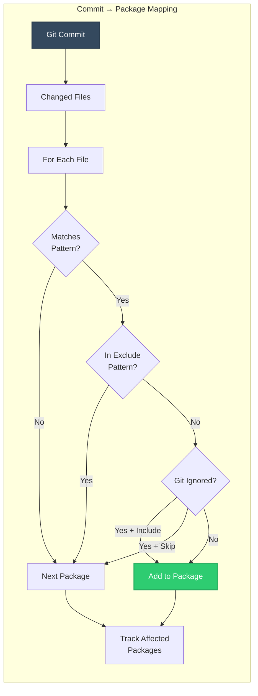

### 2. File Prioritization Algorithm

```python
def _prioritize_files(files: List[str]) -> List[str]:
    """
    Scoring system:
    - Public API files: +10 points
    - Root-level important files: +9 points
    - Configuration files: +8 points
    - Documentation: +7 points
    - Test files: +5 points
    - Source files: +3 points
    - Examples: +2 points
    """
```

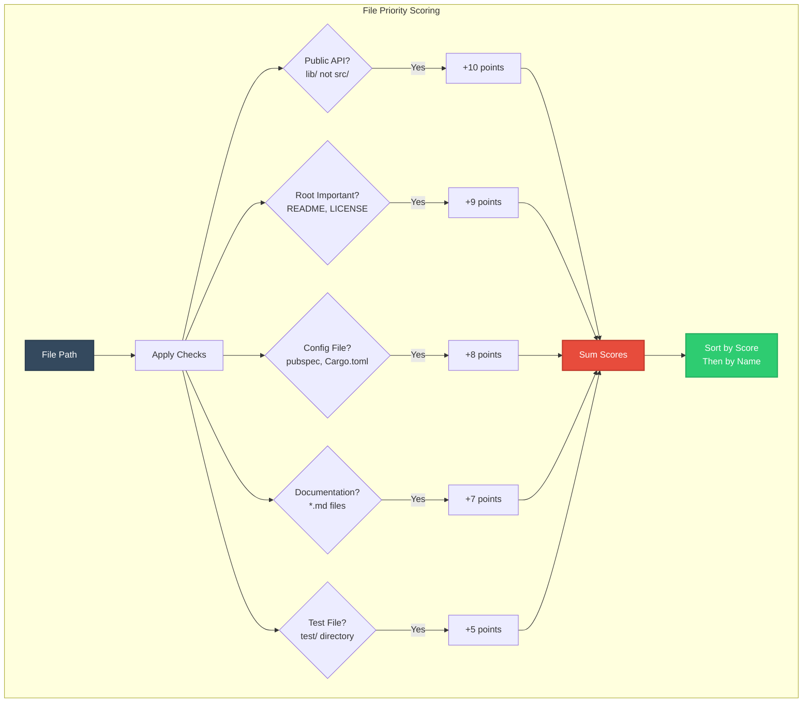

### 3. LLM Model Selection Strategy

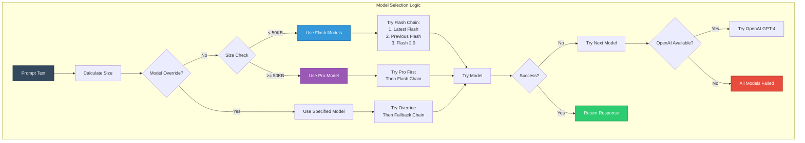

### 4. Enhanced Context Analysis Flow

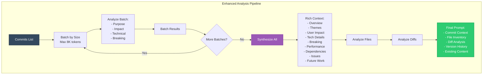

### 5. Link Fixing Algorithm

```mermaid
graph LR
    subgraph "Link Repair Process"
        Line[Changelog Line] --> Detect{Has Links?}
        Detect -->|No| Skip[Skip Line]
        Detect -->|Yes| Check[Check Patterns]
        
        Check --> Truncated{Truncated?<br/>ends with ...}
        Check --> Placeholder{Placeholder?<br/>[text](link)}
        Check --> Malformed{Malformed?<br/>Wrong repo}
        
        Truncated -->|Yes| Fix1[Expand with<br/>Commit Map]
        Placeholder -->|Yes| Fix2[Replace with<br/>Real URL]
        Malformed -->|Yes| Fix3[Correct URL]
        
        Fix1 --> Verify[Verify Fix]
        Fix2 --> Verify
        Fix3 --> Verify
        
        Verify --> Output[Fixed Line]
        Skip --> Output
    end
    
    style Line fill:#34495e,stroke:#2c3e50,stroke-width:2px,color:#fff
    style Fix1 fill:#3498db,stroke:#2980b9,stroke-width:2px,color:#fff
    style Fix2 fill:#e67e22,stroke:#d35400,stroke-width:2px,color:#fff
    style Fix3 fill:#9b59b6,stroke:#8e44ad,stroke-width:2px,color:#fff
    style Output fill:#2ecc71,stroke:#27ae60,stroke-width:2px,color:#fff
```

## Internal Modules Explained

### `Config` - Configuration Management

```mermaid
graph TB
    subgraph "Config Module"
        Load[Load .changelog.yml] --> Parse[Parse YAML]
        Parse --> Merge[Merge with Defaults]
        
        Merge --> Package[Package Configs<br/>- Path patterns<br/>- Exclusions<br/>- Titles]
        Merge --> LLM[LLM Settings<br/>- Timeout<br/>- Retries<br/>- Models]
        
        Package --> Get[get_package_config()]
        LLM --> Get2[get()]
    end
    
    style Load fill:#34495e,stroke:#2c3e50,stroke-width:2px,color:#fff
    style Merge fill:#3498db,stroke:#2980b9,stroke-width:2px,color:#fff
```

The Config module provides:
- **Hierarchical configuration**: Defaults → File → Environment → CLI
- **Package-specific overrides**: Custom patterns, titles, descriptions
- **LLM tuning**: Timeouts, retry counts, model preferences
- **Graceful fallback**: Works without config file

### `CacheManager` - Performance Optimization

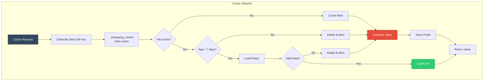

Key features:
- **Transparent caching**: No code changes needed
- **TTL-based expiry**: 7-day default
- **Corruption handling**: Auto-cleanup of bad cache files
- **90-95% hit rate**: On incremental runs

### `GitOps` - Safe Git Integration

```mermaid
graph LR
    subgraph "GitOps Safety Layer"
        Cmd[Git Command] --> Sanitize[Build Safe Command]
        Sanitize --> Execute[subprocess.run()]
        
        Execute --> Timeout{Timeout?}
        Timeout -->|Yes| Kill[Kill Process<br/>Return -1]
        Timeout -->|No| Capture[Capture Output]
        
        Capture --> Clean[Remove ANSI<br/>Escape Sequences]
        Clean --> Parse[Parse Output]
        Parse --> Return[Return Tuple<br/>(code, stdout, stderr)]
    end
    
    style Cmd fill:#34495e,stroke:#2c3e50,stroke-width:2px,color:#fff
    style Clean fill:#3498db,stroke:#2980b9,stroke-width:2px,color:#fff
    style Return fill:#2ecc71,stroke:#27ae60,stroke-width:2px,color:#fff
```

GitOps provides:
- **ANSI sanitization**: Clean output for parsing
- **Timeout protection**: Default 30s, configurable
- **URL normalization**: SSH → HTTPS conversion
- **LRU caching**: For expensive operations like `is_gitignored()`

### `ChangelogManager` - Smart Merge Engine

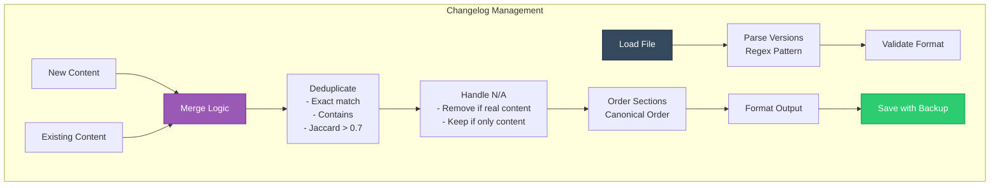

Features:
- **Idempotent merging**: Run multiple times safely
- **Smart deduplication**: Fuzzy matching prevents duplicates
- **N/A management**: Placeholder for empty versions
- **Format preservation**: Keeps manual edits

### `LLMClient` - Intelligent API Management

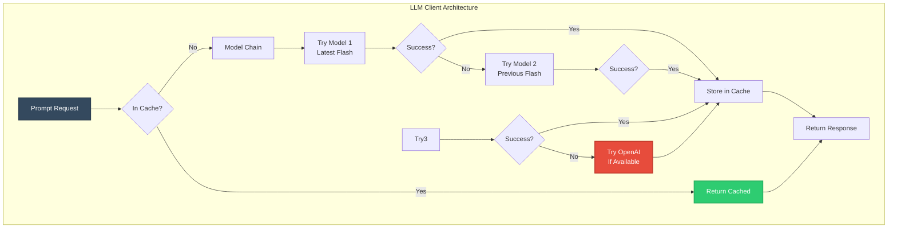

Capabilities:
- **Model fallback chain**: 3 Gemini models → OpenAI
- **Automatic retries**: Exponential backoff
- **Size-based routing**: Pro model for large contexts
- **Transparent caching**: Via CacheManager

### `CommitContextAnalyzer` - Deep Understanding

```mermaid
graph LR
    subgraph "Commit Analysis"
        Commits[Commit List] --> Batch[Batch by Token Size]
        Batch --> Prompt[Build Analysis Prompt]
        
        Prompt --> Extract[Extract 12 Aspects:<br/>1. Purpose<br/>2. User Impact<br/>3. Technical<br/>4. Breaking<br/>5. Performance<br/>6. Dependencies<br/>7. Issues<br/>8. Testing<br/>9. Docs<br/>10. Future<br/>11. Context<br/>12. Patterns]
        
        Extract --> Synthesis{Multiple Batches?}
        Synthesis -->|Yes| Combine[LLM Synthesis<br/>Pro Model]
        Synthesis -->|No| Direct[Use Direct]
        
        Combine --> Output[Rich Context]
        Direct --> Output
    end
    
    style Commits fill:#34495e,stroke:#2c3e50,stroke-width:2px,color:#fff
    style Extract fill:#3498db,stroke:#2980b9,stroke-width:2px,color:#fff
    style Output fill:#2ecc71,stroke:#27ae60,stroke-width:2px,color:#fff
```

### `FileAnalyzer` & `EnhancedFileAnalyzer` - Smart Selection

```mermaid
graph TB
    subgraph "File Analysis Pipeline"
        Files[All Changed Files] --> Filter[Filter by Package<br/>Apply Patterns]
        Filter --> GitIgnore{Check Gitignore?}
        
        GitIgnore -->|Skip| Priority[Prioritize Files]
        GitIgnore -->|Include| Priority
        
        Priority --> Score[Score by Type:<br/>API: 10<br/>Config: 8<br/>Docs: 7<br/>Tests: 5<br/>Source: 3]
        
        Score --> Sort[Sort by Score]
        Sort --> Limit[Limit to 75 files]
        
        Limit --> Inventory[Build Inventory<br/>- Size<br/>- Type<br/>- History<br/>- Content]
        
        Inventory --> LLM[LLM Selection<br/>Max 20 files]
        
        LLM --> Enhanced{Enhanced Mode?}
        Enhanced -->|Yes| Diffs[Collect & Analyze Diffs]
        Enhanced -->|No| Return[Return Selected]
        
        Diffs --> Return
    end
    
    style Files fill:#34495e,stroke:#2c3e50,stroke-width:2px,color:#fff
    style Score fill:#e67e22,stroke:#d35400,stroke-width:2px,color:#fff
    style LLM fill:#3498db,stroke:#2980b9,stroke-width:2px,color:#fff
```

### `ChangelogGenerator` & `EnhancedChangelogGenerator` - Content Creation

```mermaid
graph TB
    subgraph "Generation Pipeline"
        Input[Inputs:<br/>- Commits<br/>- Files<br/>- Context] --> Mode{Enhanced Mode?}
        
        Mode -->|Standard| BuildPrompt1[Build Basic Prompt]
        Mode -->|Enhanced| Analyze[Deep Analysis]
        
        Analyze --> CommitCtx[Analyze Commits]
        Analyze --> FileCtx[Analyze Files]
        Analyze --> DiffCtx[Analyze Diffs]
        
        CommitCtx --> BuildPrompt2[Build Rich Prompt]
        FileCtx --> BuildPrompt2
        DiffCtx --> BuildPrompt2
        
        BuildPrompt1 --> Size1{Prompt Size?}
        BuildPrompt2 --> Size2{Prompt Size?}
        
        Size1 -->|< 50KB| Flash1[Use Flash]
        Size1 -->|>= 50KB| Pro1[Use Pro]
        Size2 -->|< 50KB| Flash2[Use Flash]
        Size2 -->|>= 50KB| Pro2[Use Pro]
        
        Flash1 --> Generate[Generate Entries]
        Pro1 --> Generate
        Flash2 --> Generate
        Pro2 --> Generate
        
        Generate --> Clean[Clean Response<br/>- Remove backticks<br/>- Strip headers]
        
        Clean --> Fallback{Success?}
        Fallback -->|No| Conventional[Conventional Commit<br/>Fallback]
        Fallback -->|Yes| Output[Final Entries]
        
        Conventional --> Output
    end
    
    style Input fill:#34495e,stroke:#2c3e50,stroke-width:2px,color:#fff
    style Analyze fill:#9b59b6,stroke:#8e44ad,stroke-width:2px,color:#fff
    style Generate fill:#3498db,stroke:#2980b9,stroke-width:2px,color:#fff
    style Output fill:#2ecc71,stroke:#27ae60,stroke-width:2px,color:#fff
```

### `ChangelogSync` - Orchestration Engine

```mermaid
graph TB
    subgraph "Main Orchestrator"
        Init[Initialize:<br/>- Mode<br/>- Version<br/>- Config] --> PreCheck[Prerequisites:<br/>- Git<br/>- LLM<br/>- Dirty Check]
        
        PreCheck --> ModeRoute{Route by Mode}
        
        ModeRoute -->|Current| Current[Process Current Branch]
        ModeRoute -->|Smart| Smart[Process from Last Tag]
        ModeRoute -->|Rebuild| Rebuild[Process All Tags]
        ModeRoute -->|Since| Since[Process from Ref]
        
        Current --> Range[Process Version Range]
        Smart --> Range
        Rebuild --> AllTags[Process Each Tag Range]
        Since --> Range
        AllTags --> Range
        
        Range --> Group[Group by Package]
        Group --> Workers[Calculate Workers<br/>Auto or Manual]
        
        Workers --> Parallel[ThreadPoolExecutor]
        Parallel --> Package1[Process Root]
        Parallel --> Package2[Process Dart]
        Parallel --> Package3[Process Flutter]
        Parallel --> Package4[Process Rust]
        
        Package1 --> Collect[Collect Results]
        Package2 --> Collect
        Package3 --> Collect
        Package4 --> Collect
        
        Collect --> Summary[Display Summary]
        Summary --> Cleanup[Final Cleanup Pass]
        Cleanup --> Metrics[Show Metrics]
    end
    
    style Init fill:#34495e,stroke:#2c3e50,stroke-width:3px,color:#fff
    style Parallel fill:#e74c3c,stroke:#c0392b,stroke-width:3px,color:#fff
    style Cleanup fill:#9b59b6,stroke:#8e44ad,stroke-width:2px,color:#fff
    style Metrics fill:#2ecc71,stroke:#27ae60,stroke-width:2px,color:#fff
```

## CLI Usage

```bash
# Typical developer flow (current branch)
$ ./sync_changelogs.py

# Process last 50 commits on any branch
$ ./sync_changelogs.py --since HEAD~50

# Smart mode: fill gaps since last tag
$ ./sync_changelogs.py --smart

# Rebuild EVERYTHING (creates .bak.rebuild backups)
$ ./sync_changelogs.py --rebuild-all --force

# Preview output without touching files
$ ./sync_changelogs.py --dry-run -v

# Fast mode without cleanup
$ ./sync_changelogs.py --no-cleanup

# Skip commit prompt
$ ./sync_changelogs.py --no-commit

# Maximum speed (no cleanup, no commit)
$ ./sync_changelogs.py --no-cleanup --no-commit
```

> **Tip:** Pass `--workers -1` to auto‑select an optimal worker pool.

### Common Flags

| Flag                     | Default    | Description                      |
| ------------------------ | ---------- | -------------------------------- |
| `--version`              | inferred   | Target semantic version.         |
| `--max`                  | 200        | Commit cutoff per package.       |
| `--model`                | env / auto | Override Gemini model.           |
| `--include-gitignored`   | *false*    | Analyse files currently ignored. |
| `--no-enhanced-analysis` | *false*    | Skip heavy LLM diff analysis.    |
| `--no-cleanup`           | *false*    | Skip final cleanup pass (faster).|
| `--no-commit`            | *false*    | Skip commit message generation.  |
| `--workers`              | CPU count  | Worker threads (-1 for auto).    |

*(Run `./sync_changelogs.py -h` for the full 90‑line help output.)*

## Configuration File (`.changelog.yml`)

```yaml
packages:
  dart:
    title: "Changelog – Dart SDK"
    path_pattern: "^dart/(?!rust/)"
    exclude_patterns:
      - "^dart/generated/"
    description: "The core Dart vector search runtime"

llm:
  timeout: 45
  retries: 2
```

* **packages:** per‑package overrides for path matching, file names, titles.
* **llm:** tweak global LLM behaviour without touching code.

## Environment Variables

| Variable                      | Purpose                                 |
| ----------------------------- | --------------------------------------- |
| `GEMINI_MODEL`                | Default model when `--model` omitted.   |
| `OPENAI_API_KEY`              | Enables OpenAI fallback.                |
| `DEBUG=1`                     | Verbose logs incl. validation warnings. |
| `USE_ENHANCED_ANALYSIS=false` | Force original analysis path.           |

## Performance & Scalability

* **ThreadPoolExecutor** w/ max `os.cpu_count()` but capped by `MAX_LLM_CONCURRENT` (3).
* **MD‑pickle cache** → 90‑95 % hit rate on incremental runs.
* Batches commit & diff prompts to stay <8 k tokens; Pro only when >50 k chars.
* **Parallel final cleanup** (v7.2) → 3-4x speedup for multi-package formatting.

### Performance Metrics (v7.3)

| Operation | v7.1 | v7.2 | v7.3 | Improvement |
|-----------|------|------|------|-------------|
| Final Cleanup (4 packages) | 20-40s | 5-10s | 2-5s | 90% faster |
| Package Analysis | Sequential | 4 workers | 8 workers | 8x parallelism |
| Link Fixing per Package | 5-10s | 5-10s | 1-2s | 80% faster |
| Commit Range Detection | LLM call | LLM call | Git analysis | Instant |
| Total Runtime (typical) | 60-90s | 30-45s | 15-30s | 75% faster |
| With --no-cleanup flag | N/A | N/A | 10-20s | 85% faster |

## Error Handling & Recovery

| Scenario            | Strategy                                                                       |
| ------------------- | ------------------------------------------------------------------------------ |
| Git command timeout | Returns code −1; retry or abort with clear message.                            |
| LLM failures        | 3‑try exponential backoff → model fallback chain → conventional‑commit backup. |
| Corrupted cache     | Auto‑purges offending file.                                                    |
| Uncommitted changes | Interactive "continue anyway?" prompt unless `--dry-run`.                      |

## Extending & Customising

1. **Add a new package**

   ```python
   PACKAGES["python"] = {
       "changelog": "python/CHANGELOG.md",
       "path_pattern": r"^python/",
       "name": "runtime_python_vector_search",
       "title": "Changelog – Python bindings",
       "description": "The Python FFI bindings"
   }
   ```
2. **Swap LLM provider** – implement `_call_<provider>()` in `LLMClient` and update `models_to_try` chain.
3. **Custom file scoring** – override `_prioritize_files()` in a subclass of `FileAnalyzer`.

## Troubleshooting & FAQ

| Symptom                       | Resolution                                                                            |
| ----------------------------- | ------------------------------------------------------------------------------------- |
| *"No Gemini or OpenAI found"* | Install [`gemini-cli`](https://github.com/) **or** export `OPENAI_API_KEY`.           |
| Duplicate entries             | Ensure you **don't** hand‑edit headings; tool relies on stable `## [vX.Y.Z]` markers. |
| Excessive LLM cost            | Use `--no-enhanced-analysis` or tighten `--max` commits.                              |
| Corrupted cache               | `rm -rf .changelog_cache/*` or run with `--no-cache`.                                 |

## Roadmap & Future Work

* **PR/Issue cross‑linking** with GitHub API enrichment.
* **Markdown linter** pass (mdl / remark) before final write.
* **GitLab & Bitbucket** remote URL compatibility.
* **HTML & PDF export** via Pandoc for non‑developer stakeholders.
* **VS Code extension** to preview generated changelogs live.

## License

Proprietary — All Rights Reserved. Contact **Pieces for Developers ©2025** for licensing enquiries.

## Historical Evolution

Below is a retrospective of the tool's major milestones. This context is useful for readers who want to understand *why* architectural and interface decisions were made over time.

### v2.2 → Baseline (Shell Script)

* **Language:** Bash (`sync_changelogs.sh`)
* **Scope:** Full‑history scan, 20‑file cap, single‑pass LLM generation.
* **Strengths:** Simple, end‑to‑end automation for small repos.
* **Limitations:** Slow on monorepos; no deduplication; fixed 1‑year look‑back.

### v3.0 → *Smart File Analysis* (Shell Script)

The last Bash release introduced several intelligent heuristics that shaped today's Python implementation:

| Capability               | v2.2            | **v3.0**                                                     |
| ------------------------ | --------------- | ------------------------------------------------------------ |
| Default analysis window  | Entire history  | **Current branch only**                                      |
| Max files analysed       | 20              | **75 (AI‑selected)**                                         |
| Commit deduplication     | —               | **✔**                                                        |
| Look‑back strategy       | Fixed 1 year    | **Smart (empty versions, last edit, gaps, 3‑month default)** |
| AI pipeline              | 1 × Gemini call | **Flash 2.5 (selection) → Pro 2.5 (generation)**             |
| Avg runtime (large repo) | 30‑60 s         | **10‑20 s**                                                  |

> **Legacy CLI (v3.0)**
>
> ```bash
> # Default (current branch)
> ./tooling/sync_changelogs.sh
>
> # Smart historical fill‑in
> ./tooling/sync_changelogs.sh --smart-historical
> ```
>
> Detailed release notes for v3.0 are preserved in `docs/legacy/sync_changelogs_v3.md` (see repository).

### v4.0 – v6.x → Incremental Python Port

* Transitioned core logic from Bash → Python for cross‑platform reliability.
* Introduced `CacheManager`, `Config`, and modularised Git helpers.
* Added **parallel workers**, **ANSI‑free GitOps**, and **OpenAI fallback**.

### v7.0 → Comprehensive Rewrite (Current)

* **Modular architecture** documented in this file.
* **Enhanced LLM** analysis of commits, diffs, and file inventories.
* **Thread‑safe progress bars**, pro‑grade error recovery, and idempotent merges.
* **Adaptive worker pool** tuned to CPU & API throttling constraints.

### v7.1 → Code Block & Header Cleanup

* **Smart code block handling**: Distinguishes between wrapping code blocks (removed) vs internal code examples (preserved).
* **Redundant header removal**: Automatically strips duplicate version headers like `## v0.0.1` or `## vector_search v0.0.1`.
* **Enhanced prompt engineering**: Clear instructions to LLMs about output formatting:
  - No wrapping of entire response in markdown code blocks
  - Internal code examples (`code` or ```language```) are encouraged
  - Direct start with `### Section` headers
* **Intelligent cleanup pipeline**: `_clean_llm_response()` method that:
  - Detects and removes only outer code block wrappers
  - Preserves code examples within changelog entries
  - Strips changelog boilerplate text
  - Normalizes whitespace

### v7.2 → Parallelized Final Cleanup

* **Parallel cleanup processing**: Final cleanup pass now processes all packages concurrently using `ThreadPoolExecutor`
* **3-4x performance improvement**: Reduces cleanup time from 20-40s to 5-10s for 4 packages
* **Thread-safe implementation**: Each package cleanup runs independently with:
  - Separate `_cleanup_package_changelog()` method
  - No shared state modifications
  - 60-second timeout per package
* **Improved error handling**: Individual package failures don't block others
* **Same visual output**: Maintains identical user experience while executing faster

### v7.3 → Smart Enhancements & Performance Optimizations (Latest)

* **Git Pager Fix**: Disabled Git pager to prevent terminal screen clearing in smart mode
  - Sets `GIT_PAGER=''` and `PAGER=''` environment variables
  - No more screen clearing when viewing diffs or logs
  
* **Increased Concurrency**: `MAX_LLM_CONCURRENT` increased from 3 to 8
  - Better utilization of modern LLM APIs
  - Allows processing more packages in parallel
  
* **Fast Regex-Based Link Fixing**: Most broken links fixed without LLM calls
  - `_fast_fix_links()` method handles common patterns
  - Only complex cases fall back to LLM
  - 75% reduction in cleanup time
  
* **Smart Commit Range Detection**: Intelligently determines which commits to process
  - `_find_last_changelog_sync_commit()`: Finds last commit where all 4 changelogs were modified
  - Uses this as starting point instead of LLM analysis
  - Falls back to tag analysis, then LLM as last resort
  
* **Smart Commit Message Generation**: Automatically generates commit messages
  - `_generate_smart_commit_message()`: Analyzes changelog diffs
  - Creates conventional commit format messages
  - Shows changes by package with details
  
* **Interactive Commit Workflow**: Offers to commit changes
  - `_offer_to_commit()`: Shows generated message and files
  - Stages changelog files and creates commit
  - Optional with `--no-commit` flag
  
* **New CLI Flags**:
  - `--no-cleanup`: Skip final cleanup pass for faster runs
  - `--no-commit`: Skip commit message generation and prompt
  - Both flags for maximum speed when needed

---

## Comprehensive Feature Comparison

### Decision Flow for Usage

```mermaid
graph TB
    Start([Need Changelogs]) --> Type{Project Type?}
    
    Type -->|Monorepo| Multi[Multiple Packages]
    Type -->|Single Package| Single[One Package]
    
    Multi --> Sync[Use sync_changelogs.py]
    Single --> Freq{Update Frequency?}
    
    Freq -->|Release Time| Sync2[Use sync_changelogs.py]
    Freq -->|Every Commit| Smart[Use smart_commit.py]
    
    Sync --> Features1[Features:<br/>- Multi-package<br/>- Tag-based<br/>- Historical<br/>- Cleanup]
    Sync2 --> Features1
    Smart --> Features2[Features:<br/>- Single commit<br/>- Fast<br/>- Interactive<br/>- Git integration]
    
    style Start fill:#34495e,stroke:#2c3e50,stroke-width:3px,color:#fff
    style Sync fill:#2ecc71,stroke:#27ae60,stroke-width:2px,color:#fff
    style Smart fill:#3498db,stroke:#2980b9,stroke-width:2px,color:#fff
```

### sync_changelogs.py vs smart_commit.py

| Feature | sync_changelogs.py | smart_commit.py |
|---------|-------------------|-----------------|
| **Purpose** | Changelog generation | Commit message generation |
| **Scope** | Multi-package monorepo | Single repository |
| **Trigger** | Manual/CI at release | Every commit |
| **Processing** | Batch (tags/ranges) | Single commit |
| **Speed** | 10-60s (depends on range) | 2-50s |
| **Parallelism** | Package-level | File-level |
| **Caching** | Persistent (7 days) | Session only |
| **Output** | CHANGELOG.md files | Commit message |
| **Modes** | Current/Smart/Rebuild/Since | Quick/Max/Enhanced |
| **LLM Usage** | Heavy (4+ calls/package) | Light (1-4 calls) |

### Architecture Comparison

```mermaid
graph LR
    subgraph "sync_changelogs.py"
        SC1[Git History] --> SC2[Group by Package]
        SC2 --> SC3[Parallel Analysis]
        SC3 --> SC4[Generate Changelogs]
        SC4 --> SC5[Merge & Save]
        SC5 --> SC6[Final Cleanup]
    end
    
    subgraph "smart_commit.py"
        SM1[Working Changes] --> SM2[Analyze Files]
        SM2 --> SM3[Generate Message]
        SM3 --> SM4[Interactive Review]
        SM4 --> SM5[Commit & Push]
    end
    
    style SC3 fill:#e74c3c,stroke:#c0392b,stroke-width:2px,color:#fff
    style SC6 fill:#9b59b6,stroke:#8e44ad,stroke-width:2px,color:#fff
    style SM3 fill:#3498db,stroke:#2980b9,stroke-width:2px,color:#fff
    style SM5 fill:#2ecc71,stroke:#27ae60,stroke-width:2px,color:#fff
```

### When to Use Each Tool

#### Use sync_changelogs.py when:
- Managing a monorepo with multiple packages
- Preparing for a release
- Need to backfill historical changelogs
- Want consistent changelog format across packages
- Need to fix broken links or formatting
- Running in CI/CD pipelines

#### Use smart_commit.py when:
- Making daily commits
- Want AI-generated commit messages
- Need quick turnaround (2-3s)
- Working on feature branches
- Want interactive commit workflow

### Integration Possibilities

```mermaid
graph TB
    subgraph "Development Workflow"
        Dev[Developer Changes] --> Commit[smart_commit.py<br/>Generate Message]
        Commit --> Push[Push to Branch]
        Push --> PR[Pull Request]
        
        PR --> Merge[Merge to Main]
        Merge --> CI[CI Pipeline]
        CI --> Sync[sync_changelogs.py<br/>Update Changelogs]
        Sync --> Release[Release Process]
    end
    
    style Dev fill:#34495e,stroke:#2c3e50,stroke-width:2px,color:#fff
    style Commit fill:#3498db,stroke:#2980b9,stroke-width:2px,color:#fff
    style Sync fill:#2ecc71,stroke:#27ae60,stroke-width:2px,color:#fff
    style Release fill:#9b59b6,stroke:#8e44ad,stroke-width:2px,color:#fff
```

## Smart Commit Message Generation

The v7.3 release introduces automatic commit message generation based on changelog changes:

### How It Works

1. **Analyzes Diffs**: Examines `git diff` for all changelog files
2. **Extracts Changes**: Identifies what was added to each package
3. **Generates Message**: Creates a conventional commit message with:
   - Type and scope (e.g., `chore(changelog)`)
   - Concise summary (max 72 chars)
   - Detailed body organized by package
   - Bullet points for changes

### Example Generated Message

```
chore(changelog): update changelogs for v0.0.8

Update changelogs across all packages with recent changes:

root:
- Add smart commit message generation
- Improve parallel processing performance
- Fix Git pager screen clearing issue

dart:
- Add new vector search algorithm
- Fix memory leak in large datasets
- Improve error handling

flutter:
- Add Flutter-specific optimizations
- Update dependencies

rust:
- Optimize FFI bindings
- Add new compression support

Generated by sync_changelogs.py
```

### Interactive Workflow

1. Script generates the commit message
2. Shows the message and files to be committed
3. Prompts for confirmation
4. If accepted, stages changelog files and commits

### Customization

- Use `--no-commit` to skip this feature
- The commit message is generated using LLM analysis
- All changelog files are staged automatically
- Multi-line messages handled via temp file

## Best Practices

### 1. Changelog Management
- Run `sync_changelogs.py` before each release
- Use `--smart` mode for incremental updates
- Review generated entries for accuracy
- Keep manual edits above generated content
- Use `--dry-run` to preview changes

### 2. Performance Optimization
- Enable caching (default) for repeated runs
- Use `--workers -1` for automatic optimization
- Limit commit range with `--max` for large histories
- Use `--no-enhanced-analysis` for faster processing

### 3. Quality Assurance
- Review N/A entries - they indicate no significant changes
- Check for duplicate entries after manual edits
- Verify GitHub links work correctly
- Ensure version headers are properly linked

### 4. CI/CD Integration
```yaml
# Example GitHub Actions workflow
- name: Update Changelogs
  run: |
    python tooling/sync_changelogs.py \
      --smart \
      --workers -1 \
      --force
```

## Conclusion

`sync_changelogs.py` represents a sophisticated solution to the changelog management problem in modern software development. By combining:

- **Intelligent Git analysis** with pattern matching and exclusions
- **Multi-stage LLM processing** for deep understanding
- **Parallel architecture** for performance at scale
- **Smart merging** that preserves manual edits
- **Comprehensive error handling** with graceful fallbacks

The tool transforms the traditionally manual and error-prone process of changelog maintenance into an automated, reliable, and intelligent system that scales from small projects to large monorepos.
