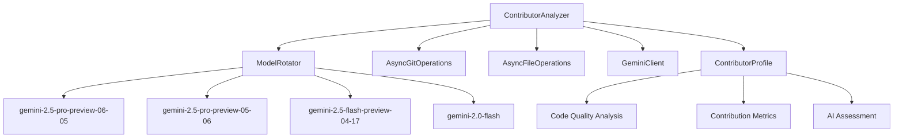

# Contributor Analysis Architecture

## Overview

The Contributor Analysis Tool is a sophisticated system that analyzes GitHub contributors across organizations using AI-powered code quality assessment, parallel processing, and intelligent model rotation. It builds comprehensive profiles by analyzing commits, PRs, and actual code files.

## System Architecture

### Core Components



### Analysis Pipeline

The system operates in 6 distinct phases:

## Phase 1: Repository Discovery 🔍

**Purpose**: Discover all repositories to analyze across specified organizations.

**Process**:
1. Uses GitHub CLI to list repositories in each organization
2. Filters to specified repositories if provided
3. Builds comprehensive repository list for analysis

**Example**:
```bash
gh repo list pieces-app --json name --limit 1000
gh repo list open-runtime --json name --limit 1000
```

## Phase 2: Contributor Discovery 👥

**Purpose**: Identify all unique contributors across repositories.

**Process**:
1. For each repository, queries GitHub API for contributors
2. Collects unique usernames across all repositories
3. Builds set of contributors to analyze

**Parallelization**: Uses asyncio semaphore to limit concurrent API calls

## Phase 3: Contribution Data Collection 📊

**Purpose**: Gather detailed contribution metrics for each contributor.

**Data Collected**:
- **Basic Profile**: Name, email, GitHub username
- **Contribution Metrics**: Total commits, PRs, issues
- **Activity Timeline**: First/last contribution dates
- **Repository Activity**: Which repos they contribute to
- **Contribution Frequency**: Commits per week calculation

**Process**:
```python
# For each contributor:
user_profile = await get_user_profile(username)
for org, repos in organizations.items():
    for repo in repos:
        commits = await analyze_repo_contributions(username, org, repo)
        prs = await get_pull_requests(username, org, repo)
```

## Phase 4: Repository Cloning & Code Analysis 📦🔍

**Purpose**: Clone repositories to isolated directory and analyze actual code files.

### Isolated Environment Setup

**Critical Security Feature**: All repositories are cloned to an isolated temporary directory, completely separate from the host machine's code:

```python
# Creates isolated directory
analysis_dir = Path(tempfile.mkdtemp(prefix="contributor_analysis_"))

# Example: /tmp/contributor_analysis_abc123/
#   ├── pieces-app_pieces-os/
#   ├── pieces-app_cli-agent/  
#   ├── open-runtime_flutter-module/
#   └── open-runtime_dart-tools/
```

**Automatic Cleanup**: Directory is automatically removed after analysis completion or failure.

### Repository Cloning Process

```python
# Shallow clone for performance
gh repo clone org/repo /tmp/analysis_dir/org_repo --depth 50
```

**Features**:
- **Parallel Cloning**: Multiple repositories cloned simultaneously
- **Shallow Clones**: Only recent commits for performance
- **Skip Existing**: Won't re-clone if repository already exists

### Code Quality Analysis

**For Each Contributor**:

1. **Recent Commit Analysis**:
   ```bash
   git log --author=username --max-count=10 --format=%H|%s|%ad
   ```

2. **Changed File Discovery**:
   ```bash
   git show --name-only --format= commit_sha
   ```

3. **Code File Filtering**:
   - Analyzes only actual code files (.py, .js, .ts, .dart, etc.)
   - Skips build artifacts, dependencies, generated files
   - Filters out `node_modules`, `dist`, `.git`, etc.

4. **Content Analysis**:
   - Reads file contents (up to 100KB per file)
   - Extracts code samples for AI analysis
   - Tracks programming language usage
   - Limits to configurable max files per contributor

## Phase 5: AI Analysis 🤖

**Purpose**: Use AI to analyze code quality, patterns, and technical skills.

### Model Rotation Strategy

The system uses intelligent model rotation with fallback:

```python
MODELS = [
    "gemini-2.5-pro-preview-06-05",  # Best model first
    "gemini-2.5-pro-preview-05-06",  # Second best
    "gemini-2.5-flash-preview-04-17", # Faster preview
    "gemini-2.0-flash"  # Stable fallback
]
```

**Smart Fallback Logic**:
1. Prefers better preview models for quality analysis
2. Tracks model failures and rate limiting
3. Implements 5-minute cooldown for failed models
4. Falls back to stable `gemini-2.0-flash` when previews are rate limited
5. Automatic retry with fallback model on errors

### AI Analysis Types

#### 1. Contribution Pattern Analysis
- Analyzes commit frequency and patterns
- Assesses contribution consistency
- Evaluates collaboration patterns

#### 2. Code Quality Assessment
- **Code Quality Score**: 1-10 rating based on code samples
- **Code Patterns**: Common practices in their code
- **Style Assessment**: Professional evaluation of coding style
- **Architectural Contributions**: Major design/architecture work

**AI Prompt Structure**:
```
Analyze code quality for contributor {username}

Context:
- Total Code Samples: 15
- Primary Languages: Python (8), TypeScript (5), Dart (2)
- Code Samples: [actual code content]

Requirements:
- Assess overall code quality on scale 1-10
- Identify common patterns and practices
- Evaluate code style and consistency
- Identify architectural contributions
- Note strengths and improvement areas

Response Format: JSON with quality_score, patterns, style_assessment, etc.
```

## Phase 6: Profile Generation 📝

**Purpose**: Generate comprehensive markdown profiles with all analysis data.

### Profile Structure

Each profile (`profiles/username-at-org.md`) contains:

```markdown
# Full Name (@username)

## Overview
- Basic information and contact details
- Analysis period and last update

## Contribution Summary
| Metric | Value |
|--------|-------|
| Total Commits | 247 |
| Total PRs | 45 |
| Active Repositories | 8 |
| Contribution Frequency | 3.2 commits/week |

## Code Quality Analysis
| Metric | Value |
|--------|-------|
| Code Quality Score | 8.5/10 |
| Primary Languages | Python (15), TypeScript (8) |
| Code Files Analyzed | 23 |

### Code Style Assessment
Professional coding style with excellent documentation practices...

### Code Patterns & Practices
- Uses clean, modular functions
- Implements proper error handling
- Follows consistent naming conventions

### Architectural Contributions
- Designed user authentication system
- Implemented caching layer for API responses

## Technical Metrics
- Language expertise and usage patterns
- Code review participation
- Notable contributions

## AI Analysis
Detailed AI assessment of technical skills and work quality...
```

## Iterative Profile Building

### Update Mode Process

When running in `--update` mode, the system:

1. **Loads Existing Profiles**: Reads current profiles if they exist
2. **Incremental Analysis**: Only analyzes new commits since last update
3. **Merge Data**: Combines new data with existing profile data
4. **Preserve History**: Maintains historical metrics and trends
5. **Update Timestamps**: Records when profile was last updated

### From-Scratch Mode Process

When running in `--from-scratch` mode, the system:

1. **Clean Slate**: Ignores any existing profiles
2. **Full Analysis**: Analyzes entire contribution history
3. **Complete Rebuild**: Generates entirely new profiles
4. **Fresh AI Analysis**: Re-runs all AI assessments

## Performance Optimizations

### Parallel Processing

```python
# Concurrent repository cloning
semaphore = asyncio.Semaphore(max_workers)
tasks = [clone_repo(org, repo) for org, repos in organizations.items() for repo in repos]
await asyncio.gather(*tasks)

# Parallel contributor analysis  
tasks = [analyze_contributor(username) for username in contributors]
await asyncio.gather(*tasks)
```

### Rate Limiting

- **GitHub API**: Respects rate limits with configurable RPM
- **AI Models**: Intelligent model rotation to avoid rate limits
- **File Analysis**: Limits files analyzed per contributor
- **Semaphores**: Controls concurrent operations

### Caching

- **AI Responses**: Caches AI analysis results
- **Repository Data**: Avoids re-cloning existing repositories
- **Profile Data**: Preserves analysis between runs

## Configuration Options

```bash
# Basic usage
contributors --organizations pieces-app open-runtime

# Advanced configuration
contributors \
  --from-scratch \
  --max-workers 8 \
  --max-files-per-contributor 30 \
  --analysis-dir ./isolated_analysis \
  --profiles-dir ./team_profiles \
  --since 6months

# Skip code analysis for faster execution
contributors --skip-code-analysis --update
```

## Security Considerations

### Isolated Analysis Environment

- **Temporary Directory**: All analysis happens in isolated temp directory
- **Automatic Cleanup**: Directories removed after analysis
- **No Host Contamination**: Repository clones don't affect host machine
- **Shallow Clones**: Minimal data transfer and storage

### Access Control

- **GitHub CLI Authentication**: Uses user's authenticated GitHub CLI
- **API Key Management**: Securely handles Gemini API keys
- **Rate Limiting**: Respects all API rate limits

## Monitoring and Debugging

### Real-Time Progress

```
🔍 Discovering repositories...        ✅ Found 47 repositories
👥 Discovering contributors...        ████████████ 47/47
📊 Collecting contribution data...    ████████████ 23/23  
📦 Cloning repositories...           ████████████ 47/47
🔍 Analyzing code files...           ████████████ 23/23
🤖 AI analysis of contributions...   ████████████ 23/23
📝 Generating profiles...            ████████████ 23/23
```

### Model Status Tracking

The system tracks AI model health:
- **Available**: Model ready for use
- **Cooling Down**: Model in rate limit cooldown
- **Failed**: Model encountered errors

### Comprehensive Logging

- **Debug**: Detailed operation logging
- **Info**: Major phase completion
- **Warning**: Rate limits and fallbacks
- **Error**: Failed operations with context

## Example Workflows

### Initial Team Analysis

```bash
# Comprehensive analysis of entire team
contributors \
  --organizations pieces-app open-runtime \
  --from-scratch \
  --since 1year \
  --max-workers 6
```

### Weekly Updates

```bash
# Quick updates for recent activity
contributors \
  --update \
  --since 1week \
  --skip-code-analysis  # Faster updates
```

### Deep Code Analysis

```bash
# Detailed code quality assessment
contributors \
  --from-scratch \
  --max-files-per-contributor 50 \
  --since 3months
```

## Output and Integration

### Generated Profiles

- **Location**: `profiles/` directory
- **Format**: Markdown for easy viewing and integration
- **Naming**: `username-at-organization.md`
- **Content**: Comprehensive contributor analysis

### Integration Options

- **CI/CD**: Can be run in automated pipelines
- **Reporting**: Markdown profiles integrate with documentation systems
- **Analytics**: JSON data can feed into analytics dashboards
- **Team Reviews**: Human-readable profiles for performance reviews

This architecture ensures scalable, secure, and comprehensive analysis of contributor performance across your GitHub organizations. 